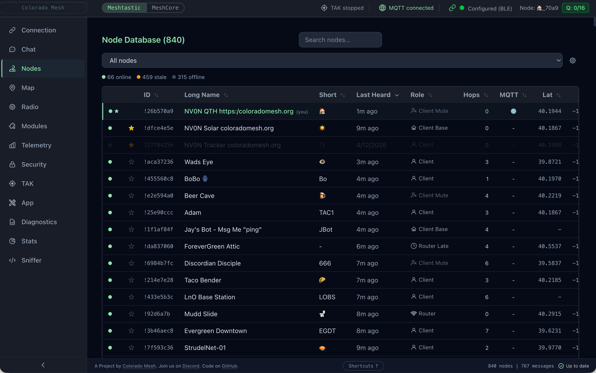
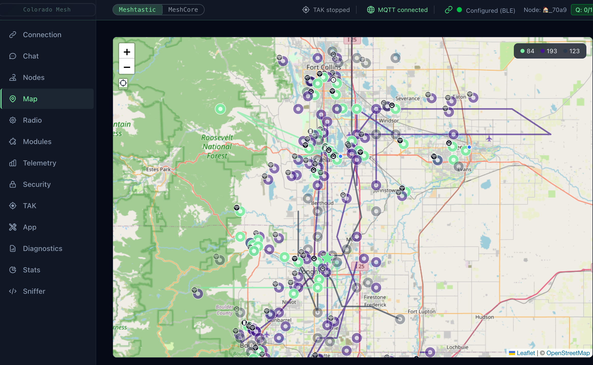
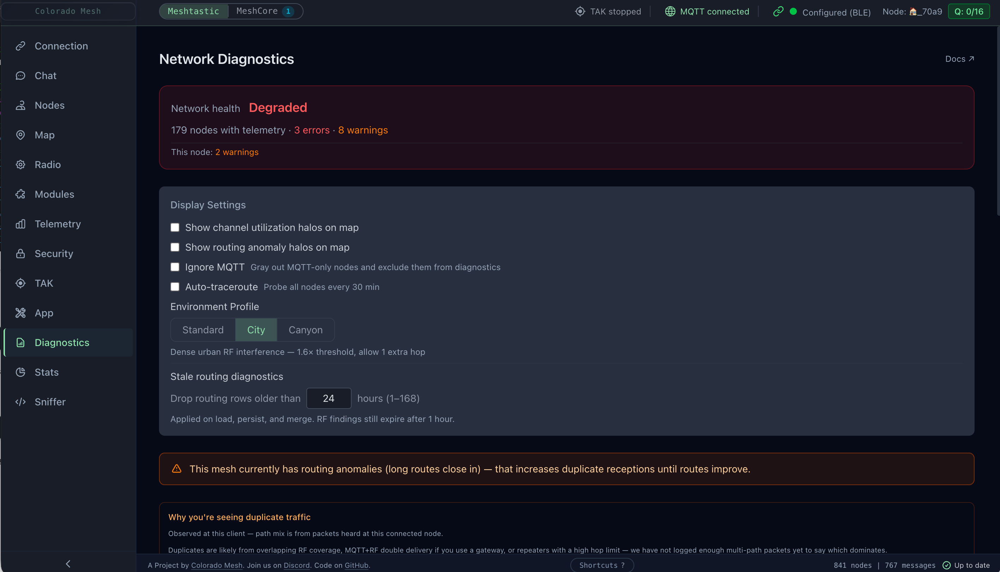
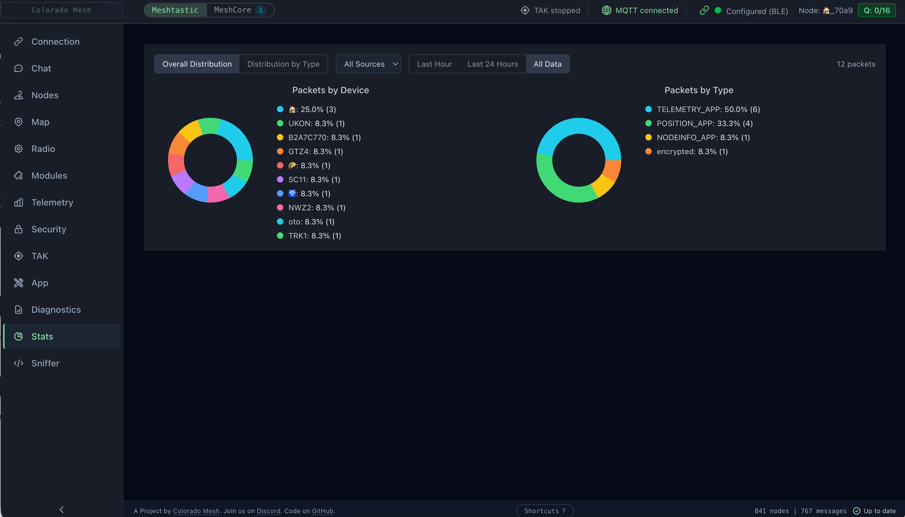
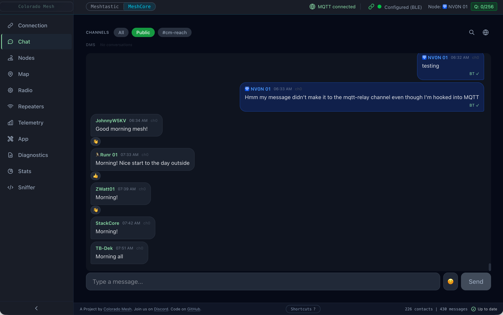
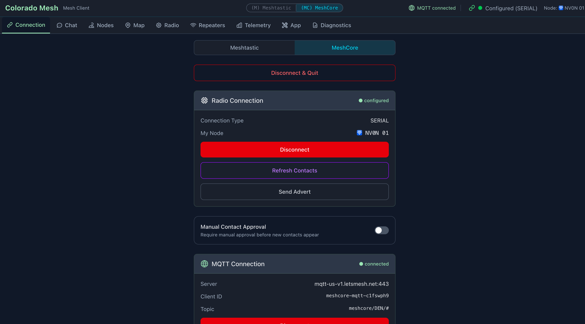
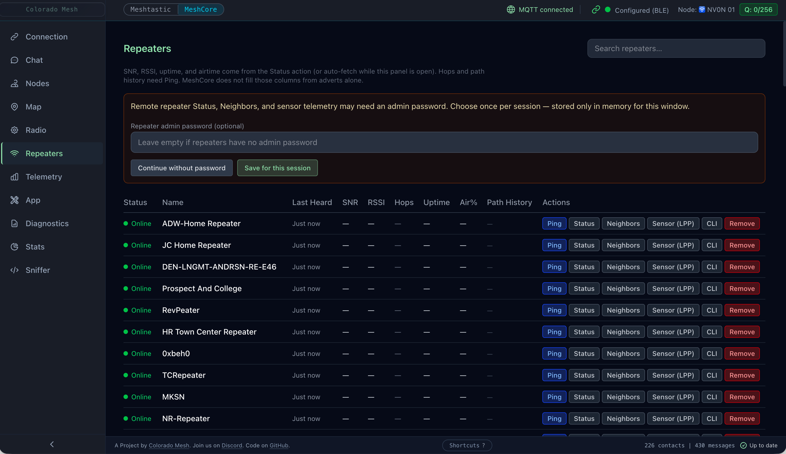
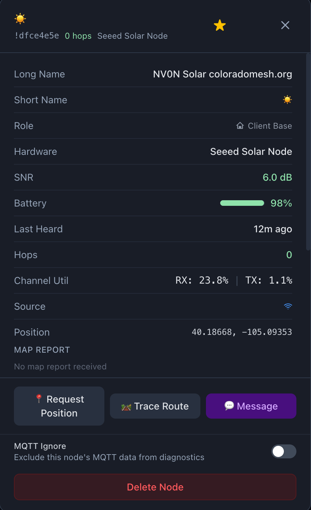
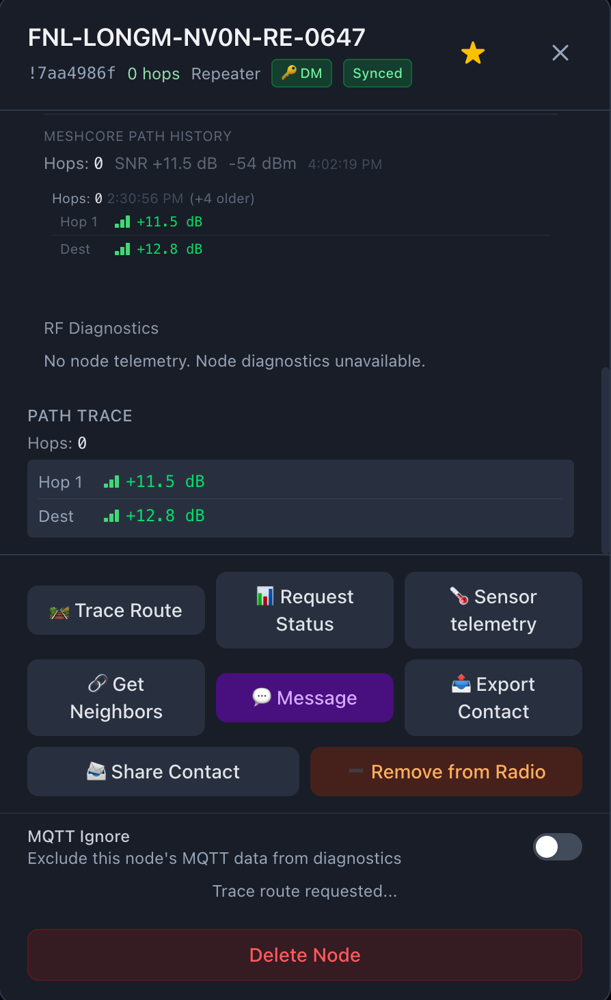

# Mesh-Client

> Cross-platform **Electron** desktop client for **Meshtastic** and **MeshCore** on **macOS**, **Linux**, and **Windows** with **BLE**, **USB serial**, **Wi‑Fi/TCP**, **MQTT**, local **SQLite** history, **routing diagnostics**, and **16-language UI**.


[](https://github.com/Colorado-Mesh/mesh-client/actions/workflows/ci.yaml)
[](https://github.com/Colorado-Mesh/mesh-client/actions/workflows/release.yaml?query=event%3Apush)
[](https://github.com/Colorado-Mesh/mesh-client/actions/workflows/flatpak.yaml)

[](https://github.com/Colorado-Mesh/mesh-client/actions/workflows/docs.yml)


**For everyone, everywhere.** We welcome community participation and collaboration in the development of this project!

---

## Why

### Mesh-Client: The Universal Desktop Suite for Mesh Networks

Reliable Desktop Power. Local Persistence. Total Insight.

While official mobile apps cover the basics, desktop power users often face a fragmented ecosystem: limited app availability for MeshCore, inconsistent support across operating systems, and persistent sync issues on macOS. Mesh-Client fills those gaps with a high-performance desktop experience.

With a dedicated local SQLite database, Mesh-Client keeps message history and mesh logs durable across restarts and sync failures. It provides one reliable hub for both Meshtastic and MeshCore firmware, delivering a unified workflow regardless of protocol or hardware.

**Why Mesh-Client?**

- **True message persistence:** Local SQLite storage for reliable long-term history, without lost chats or broken logs.
- **Universal protocol support:** One consistent interface for both Meshtastic and MeshCore devices.
- **Advanced mesh visibility:** Routing diagnostics and mesh health insight that mobile apps often skip.
- **Desktop-first workflow:** MQTT integration and a full-featured interface for power users.
- **Cross-platform stability:** A feature-rich experience across macOS, Linux, and Windows.

From real-time diagnostics to permanent message archives, Mesh-Client delivers the desktop visibility serious mesh users require.

**Known Bugs:**

- **Linux BLE**: uses Web Bluetooth (Chromium's built-in BLE API), with a user-visible picker and user gesture requirement to select a device. **MeshCore** may prompt for the radio's PIN and run OS-level pairing (`bluetoothctl`) before the connection completes when BlueZ reports the device as not paired (see [docs/development-environment.md](docs/development-environment.md#linux-bluetooth-ble)).

---

## Visuals

<details>
<summary>Screenshots</summary>

<table>
  <tr>
    <td></td>
    <td></td>
    <td></td>
    <td></td>
  </tr>
  <tr>
    <td colspan="4" align="center">
      
      
      
      
      
    </td>
  </tr>
</table>

</details>

---

## Key Features

### Meshtastic Features

**Radio & Channel Configuration**

- Edit channels: name, PSK, and role; 18 region presets and 7 modem presets
- **Channel URL import/export** (Radio tab): generate, copy, preview, and apply `https://meshtastic.org/e/#…` or `meshtastic://` links (same ChannelSet protobuf format as the Android/web clients); replace all channels or add-only mode
- Device roles: Client, Router, Tracker, Sensor, TAK, and more
- **Display**, **Bluetooth**, and **Power** settings on the Radio tab (screen/LED, pairing, sleep, and power limits)
- Per-channel MQTT gateway uplink (RF → MQTT)
- **Administration** tab: reboot, shutdown, factory reset, NodeDB reset (optional preserve favorites), reboot-to-OTA, and enter DFU (local radio only; OTA/DFU disabled when **Configure node** targets a remote node)

**MQTT**

- Subscribe to a broker to receive mesh traffic over the internet; **AES-128/256-CTR** decryption (16- or 32-byte channel PSKs), automatic RF deduplication, **cross-transport chat dedup** (when the same message arrives on MQTT and RF within ~10 minutes, one bubble is kept and the transport badge upgrades to **both**), **10-minute reconnect delay after failed attempts** (recovers faster on connack timeout), and an **active node cache** that periodically refreshes presence information so MQTT-only and RF+MQTT nodes stay visible even when your radio is offline
- **Channel PSKs** on the Connection tab: base64 keys per line (optional `ChannelName=base64` for MQTT-only channels); multiple keys per channel name are supported; LongFast default is always tried; keys from the Radio tab sync automatically when the radio is connected (custom named keys are not overwritten by the default public PSK on sync)
- **MQTT-only chat identity**: when sending without a connected radio, outbound `from` uses your last known RF node id when available, otherwise a stable per-install virtual id (persisted in app settings)
- **Enable TLS (mqtts / wss)** toggle for private brokers (not only port 8883/443); optional **Allow insecure TLS** for self-signed or non–public CA chains
- **Per-channel MQTT uplink** (RF → MQTT) uses each channel’s real name and PSK when publishing
- Transport indicator (RF / MQTT / both) on received messages; MQTT messages are shown in chat but not rebroadcast over RF
- Enter your broker URL, topic, and optional credentials in the MQTT section of the Connection tab; settings persist across sessions

**Module Configuration**

- Telemetry module (device, environment, air quality intervals), MQTT relay, Serial, External Notification, Store & Forward, Range Test, Canned Messages, Neighbor Info, Ambient Lighting, Detection Sensor, Pax Counter, Remote Hardware, Traffic Management, TAK (when firmware exposes the module key), and **RTTTL** (ringtone); editable from the **Modules** tab in firmware-dependent order (not strictly alphabetical)
- **ConfigApplyNotice** at the top of Radio, Modules, and Security reminds you that changes persist to the device and may require reboot; **Apply** stays disabled until each config slice hydrates from the device so defaults cannot overwrite live settings
- **Remote Hardware (GPIO)**: configure pins and apply module settings; live GPIO status stream when the module is enabled
- **Module status displays**: Range Test, Serial, Store & Forward, Remote Hardware (GPIO), and IP Tunnel (status-only) show packet counts and last-received timestamps when the corresponding module is enabled on the device
- **Store & Forward chat history**: after RF configure, the client may request `CLIENT_HISTORY` on the first primary router heartbeat (capped messages/window, 15 min cooldown, 5 min offline gate; opt-out in App settings). Use **Catch up from Store & Forward** in Chat for manual fetch. Replayed text shows a **Store & Forward** badge; MQTT reconnect floods within ~30 s are treated as history and deduped

**Security**

- **Meshtastic — Security (PKI)** tab (between Telemetry and App): admin / PKI key management; backup, restore, regenerate, and apply keys and related toggles from the device.
- **MeshCore — Security** tab (partial): per-node **key backup / restore** (full public + private pair), sign data, export/import private key. Meshtastic PKI admin sections are hidden (`hasSecurityPanel` is true for both protocols; capabilities differ).
- **DM / device key backup / restore:** **Backup Keys** encrypts the connected **local** radio’s **public and private keys** into a **per-node** slot (`localStorage`, OS keychain via `safeStorage`). Meshtastic indexes by `nodeNum`; MeshCore by `nodeId`. Backing up a second radio does **not** overwrite the first. **Restore Keys** applies the archive for the connected node; **Restore from backup…** picks any archived entry (factory reset / node id change). Hidden for remote configure targets. See [Key backup and cryptography](docs/key-backup-and-crypto.md) (includes **backing up before moving Meshtastic nodes to MeshCore**).
- **PKC remote node administration** (Meshtastic, firmware 2.5+): **Configure node** selector on Radio, Modules, Security, and Administration tabs to edit another node’s settings through your connected local radio; **Configure node remotely** from node detail when a per-node admin key is saved; **Copy** public key in Security for one-time trust setup. Paste a remote node’s admin public key in node detail (base64, `base64:…`, or 64-char hex). PKI uses the mesh NodeDB key when present, with stored admin-key fallback. Requires a **connected local Meshtastic radio** — MQTT-only sessions cannot administer remote nodes.

**Network Diagnostics**

- **Network health**: status band **Healthy / Attention / Degraded** plus error and warning counts. **Degraded** applies only when routing error count ≥ 3; fewer errors use **Attention** so small issues don't paint the whole panel red
- **Single table** from `diagnosticRows` (routing trace rows + RF rows), searchable; rows persist across sessions with an optional restore banner; **max age** (1–168 hours) trims stale routing (24 h default) and RF (1 h default) rows
- **Mesh congestion attribution**: orange banner when mesh-wide routing stress is present; duplicate-traffic block in node detail when relevant
- Routing anomaly detection: **hop_goblin** (distance-proven over-hopping), **bad_route** (high duplication), **route_flapping** / **path_instability** (MeshCore PathUpdated events), **impossible_hop**, **weak_link** (MeshCore per-hop SNR from trace); with remediation suggestions and severity levels
- **Channel Utilization History**: 24h CU timeline chart for the connected node in DiagnosticsPanel
- Anomaly badges inline in node list; status aura circles on the map; congestion halos toggle; global and per-node MQTT ignore
- **Environment Profile** segmented control; Standard (3 km), City (1.6× threshold), Canyon (2.6× threshold)

> See [Diagnostics Reference](docs/diagnostics.md) for a full reference on what triggers each finding and how to interpret it.

**Environment Telemetry**

- Push-based environment charts (temperature, humidity, pressure, air quality) from Meshtastic telemetry packets, displayed in the Telemetry tab

**Packet Redundancy**

- Per-node redundancy score derived from the last 20 observed packets; `+N` echo count in the node list; collapsible Path History in node detail

**TAK Server (CoT Gateway)** (Meshtastic only)

- **TAK** tab (between Security and App): broadcast mesh node positions as Cursor on Target (CoT) XML events over TLS TCP (port 8089)
- Enables **ATAK, WinTAK, and iTAK clients** to see mesh nodes on their tactical maps
- **Certificate management**: self-signed CA + server + client certificates via node-forge; regenerate anytime from the TAK tab
- **Data package generator**: export ATAK-compatible (ca.pem, client.p12, connection.pref) for direct import on TAK devices
- Auto-start option (off by default); status indicator in header when running
- **ATAK Plugin Messages**: incoming ATAK plugin packets from mesh nodes are displayed in the TAK tab with sender node and packet counts

---

### Features Available on Both Protocols

**Connectivity**

- **Bluetooth LE**: pair wirelessly; on macOS/Windows, startup auto-reconnect can run without a user gesture (Noble backend). On Linux, Web Bluetooth requires user gesture and picker selection.
- **USB Serial**: plug in via USB; auto-reconnects silently on startup (saved port signature matches the same physical device across re-enumeration)
- **WiFi / HTTP / TCP**: connect to network-enabled nodes; saves last address for quick reconnect
- **Dual-mode**: both Meshtastic and MeshCore run simultaneously; use the protocol switcher pill in the header to switch which view is active (the inactive protocol stays connected in the background); per-protocol unread badges (Meshtastic = green, MeshCore = cyan); passive toast notifications when the inactive protocol receives messages
- **Connection status in header**: device, MQTT, and TAK indicators pulse **red** after an unexpected disconnect; manual stop/disconnect stays gray; in-progress connect keeps yellow

**Chat**

- Send/receive messages across channels with per-transport delivery badges and delivery ACK / failure states
- **Durable outbox**: outgoing messages are queued in SQLite and retried until delivered; survive app restarts and connection drops
- **Long message chunking**: messages over the payload limit are auto-split into sequential `[N/T]`-prefixed chunks (word-boundary split, max 9 chunks); MeshCore MQTT-only connections are guarded from sending when no RF path is available
- **Shared composer** (`ChatComposer`): drafts, mentions, chunking, spellcheck, and emoji picker used by **Chat** and **MeshCore Rooms**; right‑click misspelling replacements (Electron spellchecker for both protocols)
- **Emoji reactions / tapbacks**: 12 quick-pick reactions plus compose emoji (native panel on macOS/Windows; `emoji-picker-element` on Linux); Meshtastic wire tapbacks decode payload UTF-8 glyphs (flags, ZWJ sequences, and legacy index 1–12); MeshCore tapbacks via channel text lines; reply-to-message with quoted preview in bubble (including room BBS posts)
- **System tray**: docked/minimized on macOS and Windows shows an unread indicator when chat or MeshCore **Rooms** traffic arrives while the window is in the background
- **`@[Display Name]` tokens** (Meshtastic / MeshCore reply, tapback, path, and inline-reference syntax) render as compact inline labels in the bubble instead of raw brackets; see [docs/meshcore-meshtastic-parity.md](docs/meshcore-meshtastic-parity.md#chat-mention-tokens)
- Unread message divider that persists across restarts; auto-scrolls on tab switch
- Direct messages (DMs) to individual nodes; **DM info header** shows battery, last heard, and SNR for the peer
- **Draft persistence**: unsent message is saved per channel/DM and restored when you return
- **Copy message**: hover action copies message text to the clipboard
- **Sender filter**: click any message sender to filter the view to that sender; Escape clears
- **Jump to date**: scroll the chat to a specific calendar date
- **Link previews**: `http`/`https` URLs in message text fetch Open Graph metadata (title, description, image) via main-process IPC; localhost and private IPs are blocked
- **Sound notifications**: audio ping for new messages in non-active channels/DMs; global mute in the toolbar; **per-conversation mute** (bell on channel/DM tabs) stored per protocol
- **Message starring**: star messages from the hover row; **Starred** view lists bookmarks across conversations (newest first, cap 200)
- **Timestamp tooltip**: hover the short time label for full date and time
- **@mention autocomplete**: type `@` to open a node-name picker; Tab or Enter to insert; arrow keys to navigate
- **Export chat**: save the current channel or DM history as a `.txt` file via Save dialog

**Node Management**

- Node list with SNR, battery, GPS, **last heard** (any live RF packet—position, telemetry, traceroute, text—not only chat); **signal bars** appear only for direct (0-hop) RF neighbors; multi-hop and MQTT-only paths omit bars; SNR in traces and neighbor views uses **color-coded quality** (good / marginal / poor)
- **Cross-Protocol Signal Analyzer**: foreign LoRa traffic detection (non-mesh packets); shown in Node Detail when present
- Distance filter, favorite/pin nodes, device role icons
- Node Detail Modal: DM, trace route with per-hop display, delete node, neighbor info, **Map Report** (Meshtastic), PaxCounter, Detection Sensor, **channel utilization** (Meshtastic), **export/share contact** (MeshCore), **node notes** (free-text, SQLite-persisted), **watch / notify** (OS desktop notification on online/offline transition)
- **Node Health Score**: composite 0–100 badge on each node row (signal 40 pts, recency 30 pts, load 20 pts, battery 10 pts); color-coded green / yellow / red with tooltip breakdown
- **JSON export**: export the full node list as JSON from NodeListPanel

**Map & Position**

- Interactive map with node positions and your current location (device GPS → browser geolocation → IP-based city-level fallback); default **OpenStreetMap** basemap with optional **Carto Dark**
- **Layers** control (Map tab, top right): switch basemap, toggle overlays (markers, movement trails, waypoints, diagnostic halos); basemap preference persists in SQLite and localStorage
- **Show on map** from the node list pin or node detail; switches to the Map tab and flies to that node
- **Position trail**: persisted path overlay (configurable 1 h – 7 days); survives restarts via SQLite; toggle and window size in App tab; wipe via Danger Zone
- Auto-refresh at configurable intervals; manual static position entry; send your position back to your device

**Telemetry**

- Battery voltage and signal quality charts (SNR/RSSI) in the Telemetry tab

**Productivity**

- **Log panel** (right rail): live app log stream, optional debug toggle, **Analyze** (scans the buffered log for connection, BLE, MQTT, and related patterns and suggests fixes), export or delete the log file
- **Updates**: permanent status in the footer (up to date, update available, errors, download progress, etc.); automatic check runs a few seconds after every launch; **Check for Updates…** in the app menu (macOS) or **Help** (Windows/Linux), or tap **Up to date** in the footer to re-check; Windows/Linux packaged builds can download in-app, macOS and dev builds open the GitHub release page
- System tray with live unread badge; app stays accessible when window is closed
- Persistent SQLite storage; DB export/import/clear in the App tab; Clear GPS Data and Reset Diagnostics without a full DB wipe

**Localization**

- **16 languages**: English, Spanish, Ukrainian, German, Chinese (Simplified), Portuguese (Brazilian), French, Italian, Polish, Czech, Japanese, Russian, Dutch, Korean, Turkish, and Indonesian; select from the globe icon in the header; see [Localization & Languages](docs/localization.md) for more details.
- Language preference persists across restarts (stored in SQLite + localStorage); falls back to English for any untranslated string
- Translations are static JSON bundles — no network calls at runtime; works fully offline

**Accessibility**

- **Keyboard navigation**: every panel, form, and control is reachable by keyboard; Tab/Shift+Tab cycles interactive elements; all sortable table headers and the hop-limit slider are arrow-key operable; focus indicator is always visible
- **Modal focus trap**: Tab cycles only within an open modal or dialog; Escape closes and returns focus to the triggering control
- **Screen reader support**: connection status changes announced via `aria-live`; modals and dialogs carry `role="dialog"` / `role="alertdialog"` with `aria-labelledby`; form errors announced immediately via `role="alert"`; sortable columns expose `aria-sort`; toggle buttons expose `aria-pressed`; icon-only controls have `aria-label`; status indicators pair color with a text alternative so they are not color-only
- **Reduce motion**: **App → Appearance → Reduce motion** toggle (`reduceMotion` in SQLite + localStorage; default off). When enabled, disables non-essential UI motion (animated icons, decorative watermark/map pulses) while keeping functional loading spinners and connection status pulses. Icon animation is controlled in-app, not via the OS `prefers-reduced-motion` setting — see [Accessibility Checklist](docs/accessibility-checklist.md) for manual verification steps
- **Windows High Contrast**: `@media (forced-colors: active)` support prevents Tailwind from overriding system colors
- **Automated tests**: vitest-axe accessibility assertions run on every major panel as part of the pre-commit test suite

---

### MeshCore Features

MeshCore runs simultaneously alongside Meshtastic. Use the protocol switcher pill in the header to bring MeshCore into view; the Meshtastic session stays connected in the background. **Meshtastic** shows **16** sidebar tabs (including **Administration**, **Security**, **TAK**, **Stats**, and **Sniffer**; no **Rooms** tab). **MeshCore** shows **16** tabs (**TAK** is hidden; **Contacts** replaces **Nodes**, **Repeaters** replaces **Modules**, and **Rooms** is MeshCore-only; **Security** shows backup/restore and crypto tools only). **Stats**, **Sniffer**, **RF**, and **Graph** are available in both protocol modes.

- **Transmit queue**: header badge (with tooltip) when the connected radio reports outbound queue depth (STATS).

**Contacts & Discovery**

- Contact list with advert-based positions, contact types (Chat, Repeater, Room), and GPS coordinates persisted to SQLite; contacts seed from DB on reconnect as a fallback cache
- **Favorite / pin**: persisted per contact in SQLite (`meshcore_contacts.favorited`)
- **Contact groups**: protocol-neutral; create and manage groups from the **Nodes** toolbar; Meshtastic has built-in groups (**GPS**, **RF+MQTT**); filter the list by group; **Room** contacts excluded from user groups by default
- **Import Contacts**: **Nodes** tab: bulk **JSON nickname import** to pre-fill contact names (not on the Repeaters panel)
- **Refresh Contacts**: pull the full contact list from the device on demand
- **Show Public Keys**: toggle to display full public keys under contact names
- **Contact Auto-Add**: configure auto-add mode (on/off), overwrite existing, max hops; apply settings to device
- **Clear All Contacts**: destructive action with confirmation (Radio tab Danger Zone)
- **Send Advert**: broadcast your node's presence (flood advert) to the mesh with loading state and toast feedback
- **Manual Contact Approval**: toggle between auto-add (contacts appear automatically when heard) and manual-add (new contacts require approval before appearing); preference is persisted and re-applied on reconnect

**Messaging**

- Channel messaging and **direct messages (DMs)** with delivery ACK tracking (`expectedAckCrc`) and failure timeout; **DM threads can be closed** from the chat UI
- **Transport badges** on received messages; **RF**, **MQTT**, or **both** (persisted as `received_via` in `meshcore_messages`); MQTT JSON chat can be used when RF is down
- **Inbound dedup** (`meshcoreStoreDedup.ts`): merges duplicate RF/MQTT echoes, companion TX echoes, and tapback self-echoes so chat and Rooms stay readable
- Incoming push events: periodic advert (0x80), path update (0x81), send confirmed (0x82), message waiting (0x83), new contact (0x8A), incoming DM (7), incoming channel message (8)
- All messages and contacts persisted to SQLite (`meshcore_messages`, `meshcore_contacts` tables)

**Room servers (BBS)** — **Rooms** tab (RF only; not MQTT)

- Login to room-server contacts (guest read-only or admin post); **Continue read-only** when the server guest password is empty (zero-byte password, matching the official Android client)
- Post plain UTF-8 after login; inbound **SignedPlain** pushes show author prefix stripped in the UI
- **Remember password**, **Auto-sync** (periodic re-login while connected, minimum 60 minutes per room), per-room unread badges (sidebar **Rooms** tab; separate from **Chat** badges)
- Room admin CLI in the Rooms panel; session/login queue and path sync in `meshcoreRoom*.ts` — see [docs/meshcore-meshtastic-parity.md](docs/meshcore-meshtastic-parity.md#meshcore-room-servers) and [Troubleshooting](docs/troubleshooting.md#meshcore-room-server-login-posts-and-windows-10)

**Diagnostics & Remote Queries**

- **Trace route** (`tracePath`): per-hop SNR display; each intermediate hop's SNR is reported individually, unlike Meshtastic's hop-count-only trace
- **Repeater Status**: on-demand query of noise floor, last RSSI/SNR, packet counts, air time, uptime, TX queue, error events, and duplicate counts; available for any contact
- **Remote Telemetry**: pull CayenneLPP-encoded environment data (temperature, humidity, barometric pressure, voltage, GPS) from any contact via `getTelemetry`; results shown inline in the node detail modal with fetch timestamp
- **Neighbor Info**: query a Repeater node's neighbor list via `getNeighbours`; shows each neighbor's name (resolved from contacts or hex prefix), how recently it was heard, and color-coded SNR

**Repeaters**

- **Repeaters panel** (MeshCore-only tab): list repeaters with on-demand status (noise floor, RSSI/SNR, packet counts, air time, uptime, TX queue); **Path** column shows a per-hop SNR sparkline from the last trace (last trace/path hop data is also stored in local SQLite so sparklines can survive app restarts); per-row **Neighbors** expands an inline neighbor list (same query as node detail)
- **Repeater CLI**: per-repeater expandable **CLI** interface; command input with Enter to send, scrollable command/response history, Up/Down arrow history navigation, quick-command bar (get name, get radio, neighbors, version, …), flood vs. auto (saved path) routing toggle; responses are correlated to commands via 2-character hex prefix tokens; configurable retries with dynamic timeout
- **Remote session authentication**: when the firmware requires it, a banner guides you through one-time setup so status and neighbor RPCs can run; credentials are session-scoped
- **Panel toolbar**: **Reboot Device** (shown when the device supports the command); **Send Advert** and **Sync Clock** moved to Radio panel Device Actions section
- **Per-repeater removal**: two-click confirm button on each row; removes from in-memory state and deletes from the SQLite contacts DB
- **Clear All Repeaters**: Danger Zone entry in the App tab that deletes all Repeater-type contacts (contact_type = 2) from the DB while leaving Chat and Room contacts intact

**Radio Parameters**

- Frequency (Hz), bandwidth, spreading factor, coding rate, and TX power; synced from device `selfInfo` and applied live via the Radio tab
- **Channel display and edit**: view and edit channel list from the device in the Radio tab; **Import Config JSON** (MeshCore) applies name and radio settings to the device and reports what was applied vs. not supported

**Battery & Signal Telemetry**

- Battery voltage from device `selfInfo`; per-packet signal telemetry (SNR/RSSI) from RF event 0x88; visible in the Telemetry tab
- **Environment charts** (temperature, humidity, barometric pressure, etc.) in the Telemetry tab when pulled Cayenne LPP data is available; same panel as Meshtastic environment telemetry
- **Raw Packet Log** (**Sniffer** tab): **MeshCore:** real-time virtualized log of RF packets from the `LOG_RX_DATA` push event (0x88), with route type, payload type, hop count, SNR, RSSI, optional resolved node name, and expandable raw hex; **Meshtastic:** log of received mesh packets (protobuf) with port/type, RF vs MQTT, SNR, RSSI, node name, and expandable hex; filter by type, name, or hex; **Clear** resets the log; ring-buffer capped at **2,500** entries per protocol

**Device Control**

- **Administration** tab: **Reboot** when connected (Meshtastic also gets shutdown, factory reset, NodeDB reset, reboot-to-OTA, and enter DFU on the same tab)
- _Not available for MeshCore_ (not implemented in the meshcore.js library): shutdown, factory reset, reset NodeDB, reboot-to-OTA, enter DFU mode

**Transport Notes**

- BLE: waits for GATT init (`connected` event) before issuing commands; includes nudge timeout for stuck `deviceQuery` on some devices. On **Windows**, **pair the MeshCore device in Settings → Bluetooth & devices** before connecting in the app; WinRT may need a bonded device for a stable Nordic UART session. On **Linux**, the app checks BlueZ pairing and may prompt for the PIN **before** Web Bluetooth completes when the radio is not bonded. A **second connect attempt** may run automatically after some transient GATT discovery or handshake timeouts (retry reuses the granted device without a new picker gesture).
- Serial: auto-reconnects on startup using a saved port signature so reconnect targets the same physical device when possible
- TCP: connects to MeshCore companion radio; default port **5000**, configurable per connection
- **MQTT (JSON v1):** The Connection tab MQTT card includes **Network Preset** buttons; **LetsMesh** (WebSocket on port 443, topic prefix `meshcore`; broker auth uses `@michaelhart/meshcore-decoder`'s `createAuthToken`; MQTT username `v1_<64-hex public key>`, password token with JWT `aud` matching the **MQTT server hostname** (e.g. `mqtt-us-v1.letsmesh.net` for the US preset); optional **Packet logger (Analyzer)** forwards RX packet summaries to the broker when enabled; see [docs/letsmesh-mqtt-auth.md](docs/letsmesh-mqtt-auth.md)), **Ripple Networks** (TLS on port 8883, same topic prefix, preset default credentials, and **Allow insecure TLS** for brokers that use a non–public CA), **Colorado Mesh** (TLS on port 8883 or 443, same topic prefix, JWT auth with custom audience mapping), and **Custom** for your own broker

---

## Limitations

- **MQTT → RF (Meshtastic)**: Downlink uses the firmware **MQTT module** (`proxy_to_client_enabled` on BLE/USB) and per-channel **downlink enabled** on the Radio tab — not legacy app `sendText` relay. mesh-client bridges `MqttClientProxyMessage` between broker and radio when proxy is active.
- **MQTT → RF (MeshCore JSON)**: Not supported; MeshCore MQTT is chat ingest only.
- **Meshtastic - PKC remote admin**: Configure-node-over-MQTT is not supported; a connected local RF radio is required to reach remote nodes (firmware 2.5+).
- **MeshCore - MQTT (JSON v1)**: The Connection tab can connect to an MQTT broker in MeshCore mode using a small JSON chat envelope (see [docs/meshcore-meshtastic-parity.md](docs/meshcore-meshtastic-parity.md)). This is separate from Meshtastic's protobuf MQTT pipeline.
- **MeshCore - partial routing diagnostics**: MeshCore now supports `route_flapping` / `path_instability` (PathUpdated events), `hop_goblin` / `bad_route` (when `hasHopCount`), and `weak_link` (when `hasPerHopSnr` and a trace is completed). Full hop-anomaly detection and Meshtastic-style LocalStats RF findings require Meshtastic packets; MeshCore provides its own RF findings (Elevated Noise Floor, Excessive Flooding) from Repeater Status packet stats.
- **MeshCore - channel editing**: Can add/edit/delete channels (name + PSK) via the Radio tab, but does not expose Meshtastic-style full protobuf config. Radio parameters (frequency, bandwidth, spreading factor, coding rate, TX power) can be set via the Radio tab.
- **MeshCore - remote telemetry availability**: `getTelemetry` requires the remote node to have environment sensors. A timeout is returned if the node has no sensor data.
- **MeshCore - neighbor info availability**: `getNeighbours` is supported only by Repeater-type nodes running firmware v1.9.0+. The button is hidden for Chat and Room contacts.
- **MeshCore - Trace Route / Ping trace**: Remote nodes typically respond only if they have **your** node as a contact. One-way or foreign heard nodes may lead to a client-side timeout; see [Troubleshooting; MeshCore: Trace Route or Ping trace times out](docs/troubleshooting.md#meshcore-trace-route-or-ping-trace-times-out).
- **MeshCore - contact type labels**: MeshCore reports a numeric `type` field (0 = None, 1 = Chat, 2 = Repeater, 3 = Room); displayed in the hw_model field in the node list.
- **MeshCore - Security tab (partial)**: Meshtastic-style PKI admin is not on MeshCore firmware; the **Security** tab shows per-node key backup/restore, sign, and export/import only. LetsMesh MQTT uses a separate **active identity cache** (`mesh-client:meshcoreIdentity`); per-node archives do not overwrite each other — see [Key backup and cryptography](docs/key-backup-and-crypto.md).
- **Map tiles; OpenStreetMap Referer requirement**: Packaged desktop builds load the UI from the local filesystem. The main process now loads the renderer with an explicit HTTP referrer so OpenStreetMap tile requests include a valid `Referer` header and comply with the [tile usage policy](https://operations.osmfoundation.org/policies/tiles/). If you point the app at a different tile server, ensure its usage policy permits this client.

---

## Quick Start

**Pre-built binaries** for **macOS**, **Linux**, and **Windows** are available in the [GitHub Releases](https://github.com/Colorado-Mesh/mesh-client/releases) area. Download the installer or archive for your platform; no Node.js or build tools required. **Flatpak** bundles (`org.coloradomesh.MeshClient-x86_64.flatpak` and `org.coloradomesh.MeshClient-aarch64.flatpak`) are published on each version tag for Flatpak-enabled Linux:

```bash
flatpak install --user ./org.coloradomesh.MeshClient-x86_64.flatpak # or -aarch64
flatpak run org.coloradomesh.MeshClient
```

VMware guests and other GPU edge cases: [Flatpak troubleshooting](docs/troubleshooting.md#flatpak-vmwgfx-driver-missing-vmware-on-macos).

**macOS (release download):** If macOS reports **"Mesh-client" is damaged and can't be opened** (or **File is damaged and cannot be opened**):

1. Open **System Settings → Privacy & Security** and scroll to the bottom. If you see "Mesh-client was blocked from use", click **Allow** to run the app.
2. If you don't see the Mesh-client entry in Privacy & Security, or the app still won't open after clicking Allow, that is usually **Gatekeeper quarantine** on downloaded, **unsigned** apps; especially on **Apple silicon (M-series)** Macs; not a corrupt file. Remove the quarantine attribute:

```bash
xattr -r -d com.apple.quarantine /Applications/Mesh-client.app
```

After running xattr, check Privacy & Security again (scroll to the bottom); the entry should now appear with an **Allow** button.

See [Troubleshooting; macOS: File is damaged…](docs/troubleshooting.md#macos-file-is-damaged-and-cannot-be-opened) and [this explanation for a similar Electron app](https://github.com/jeffvli/feishin/issues/104#issuecomment-1553914730).

**Building from source / development setup:** see [docs/development-environment.md](docs/development-environment.md) for complete shared requirements, clone/install steps, test harness setup, and detailed macOS/Windows/Linux instructions.

---

## Run Locally

**Prerequisites:** [Node.js 22.13.0+](https://nodejs.org/) and [pnpm 10+](https://pnpm.io/installation).

```bash
git clone https://github.com/Colorado-Mesh/mesh-client
cd mesh-client
pnpm install
pnpm run dev
```

For OS-specific steps; BLE permissions on macOS, serial port group on Linux, Visual Studio Build Tools on Windows; see [docs/development-environment.md](docs/development-environment.md).

---

## Usage

### Choosing a Protocol

Both protocols run at the same time. Use the **Meshtastic / MeshCore** switcher pill in the header to bring the desired protocol's view into focus; the other session remains connected in the background. Each protocol stores its own last-connection and auto-reconnects independently on startup.

### Connecting Your Device

**Meshtastic:**

1. Power on your Meshtastic device
2. Put it in Bluetooth pairing mode (if connecting via BLE)
3. Open Mesh-Client and go to the **Connection** tab, ensure **Meshtastic** is selected
4. Select your connection type (Bluetooth / USB Serial / WiFi / MQTT)
5. Click **Connect** and select your device from the picker
6. Wait for status to show **Configured**; you're connected

**MeshCore:**

1. Power on your MeshCore firmware device
2. In the Connection tab, select **MeshCore**
3. Choose **Bluetooth**, **Serial**, or **TCP** (enter the device's IP address and optional port for TCP; default port 5000)
4. Click **Connect**; the app fetches self info, contacts, and channels from the device
5. Wait for status to show **Configured**; contacts and channels are loaded

### Auto-Reconnect

After a successful connection, Mesh-Client remembers your last device per protocol. On next launch:

- **Serial**: auto-connects silently in the background (both protocols)
- **Bluetooth (macOS/Windows)**: auto-scans on launch and reconnects when the last device is discovered (no user gesture required)
- **Bluetooth (Linux)**: Web Bluetooth requires a user gesture; click **Reconnect** or **Connect** to open the picker. **MeshCore:** if the device is not paired in BlueZ, enter the PIN from the radio when prompted (OS pairing runs before the connection finishes).
- **WiFi / TCP**: a one-click reconnect card appears; click **Reconnect**
- **MQTT**: auto-reconnects using saved broker settings (Meshtastic protobuf pipeline; MeshCore JSON v1 adapter; select transport when connecting)

### MQTT

Enter your broker URL, topic, and optional credentials in the MQTT section of the Connection tab. When connected, the section collapses to a compact info card showing the server, client ID, and topic. You can send messages via MQTT without a radio when using **Meshtastic**, or **MeshCore** with brokers other than the public **LetsMesh** presets (Ripple / Custom still use the JSON v1 chat envelope for MQTT-only sends). **LetsMesh** public MQTT targets the **Analyzer** packet-logger model: optional RX summaries to `{topicPrefix}/meshcore/packets` when your radio is connected ([docs/letsmesh-mqtt-auth.md](docs/letsmesh-mqtt-auth.md)); MQTT-only channel chat to LetsMesh without a radio is not supported. **Meshtastic** uses the protobuf MQTT stack; **MeshCore** broker details are in [docs/meshcore-meshtastic-parity.md](docs/meshcore-meshtastic-parity.md). In **MeshCore** mode, **LetsMesh** / **Ripple Networks** / **Colorado Mesh** presets fill those fields for the corresponding public networks. **LetsMesh** uses the same contract as [meshcore-mqtt-broker](https://github.com/michaelhart/meshcore-mqtt-broker) with JWT `aud` matching the **regional broker hostname** you connect to (e.g. `mqtt-us-v1.letsmesh.net` / `mqtt-eu-v1.letsmesh.net`); mesh-client generates tokens from your imported MeshCore identity (`public_key` + `private_key` in config JSON). **Colorado Mesh** uses JWT auth with custom audience mapping for `meshcore_mqtt.coloradomesh.org`. Use **Custom** and paste credentials manually if your operator issued different rules.

---

## Configuration

### Connection Types

**Meshtastic** supports all four transport types:

| Platform | Bluetooth | Serial | HTTP | MQTT |
| -------- | --------- | ------ | ---- | ---- |
| macOS    | Yes       | Yes    | Yes  | Yes  |
| Windows  | Yes       | Yes    | Yes  | Yes  |
| Linux    | Yes       | Yes    | Yes  | Yes  |

**MeshCore** supports BLE, Web Serial, TCP, and optional MQTT (broker JSON v1 adapter):

| Platform | Bluetooth | Serial | TCP | MQTT (JSON v1) |
| -------- | --------- | ------ | --- | -------------- |
| macOS    | Yes       | Yes    | Yes | Yes            |
| Windows  | Yes       | Yes    | Yes | Yes            |
| Linux    | Yes       | Yes    | Yes | Yes            |

### Tech Stack

| Component    | Technology                                                                                                                         |
| ------------ | ---------------------------------------------------------------------------------------------------------------------------------- |
| Desktop      | Electron                                                                                                                           |
| UI           | React 19 + TypeScript 6 + Zustand                                                                                                  |
| Styling      | Tailwind CSS v4                                                                                                                    |
| Localization | i18next + react-i18next; 16 languages; static JSON bundles                                                                         |
| Meshtastic   | @meshtastic/core + transport-http, transport-web-serial (JSR); BLE via @stoprocent/noble (macOS/Windows) and Web Bluetooth (Linux) |
| MeshCore     | @liamcottle/meshcore.js (BLE, Web Serial, TCP via main-process IPC)                                                                |
| Maps         | Leaflet + OpenStreetMap                                                                                                            |
| Charts       | Recharts                                                                                                                           |
| Database     | SQLite (node:sqlite built-in, via db-compat.ts shim)                                                                               |
| Build        | esbuild + Vite + electron-builder + Flatpak (freedesktop 24.08, Electron2 BaseApp)                                                 |

### Architecture

For detailed project structure, data flow, and code placement guidelines, see [ARCHITECTURE.md](ARCHITECTURE.md).

### Diagnostics Reference

For a detailed explanation of every diagnostic output; routing anomalies, RF findings, packet redundancy scores, map halos, and MQTT filtering; see [Diagnostics Reference](docs/diagnostics.md).

---

## Contributing / Development

For full local setup (shared requirements, npm/tooling install, test harness, and OS-specific steps/troubleshooting), see [docs/development-environment.md](docs/development-environment.md).

Documentation uses MkDocs; if you are updating docs, install the MkDocs Python dependency (`pnpm run docs:install`) and run `pnpm run docs:build`.

For coding conventions and PR workflow, see [CONTRIBUTING.md](CONTRIBUTING.md).

---

## Community

Join the `#mesh-client` channel on Discord for help, feedback, and development discussion: https://discord.com/invite/McChKR5NpS

---

## Troubleshooting

See [Troubleshooting](docs/troubleshooting.md) for complete troubleshooting guidance.

---

## License

MIT; see [LICENSE](LICENSE)

## Credits

See [Credits](docs/credits.md). Created by **[Joey (NV0N)](https://github.com/rinchen)** & **[dude.eth](https://github.com/defidude)**. Based on the [original Mac client](https://github.com/Colorado-Mesh/meshtastic_mac_client). Part of **[Colorado Mesh](https://github.com/Colorado-Mesh/mesh-client)**.
