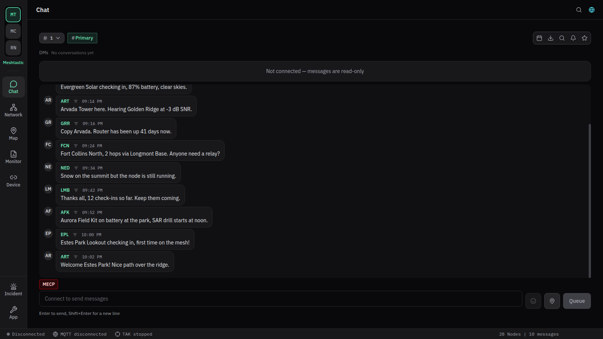
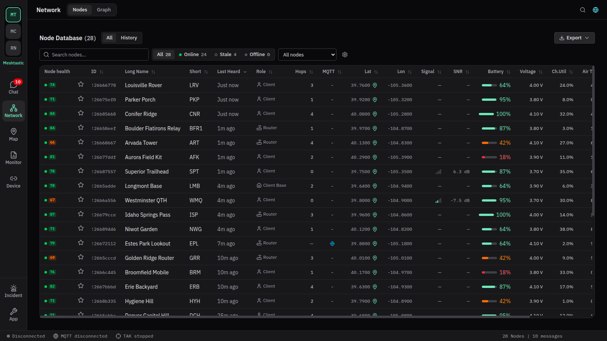
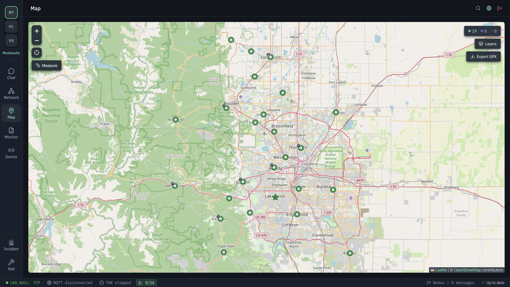
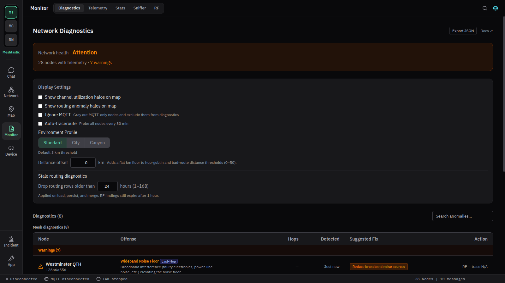
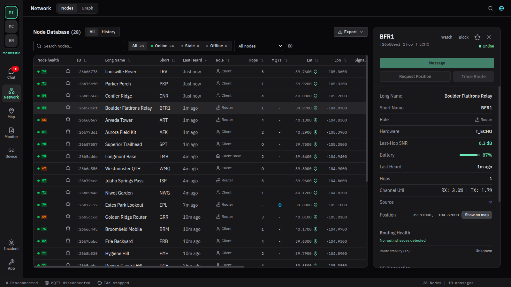
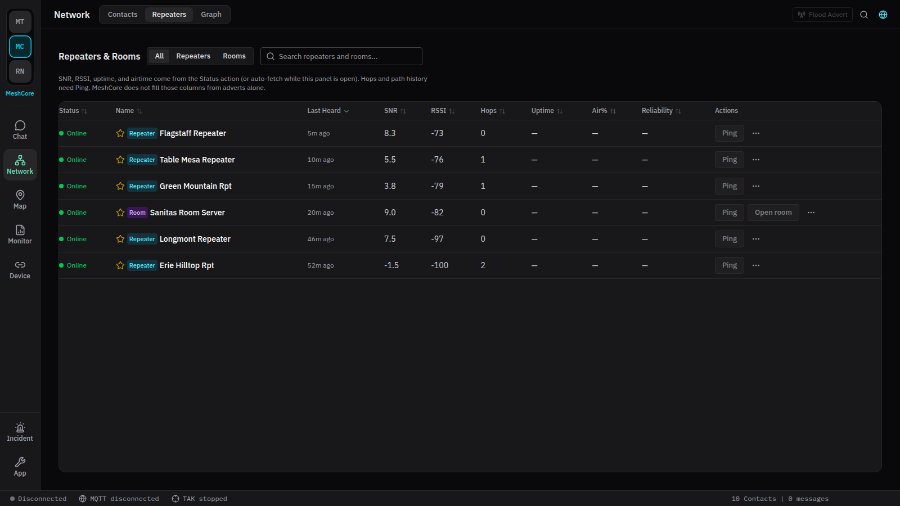
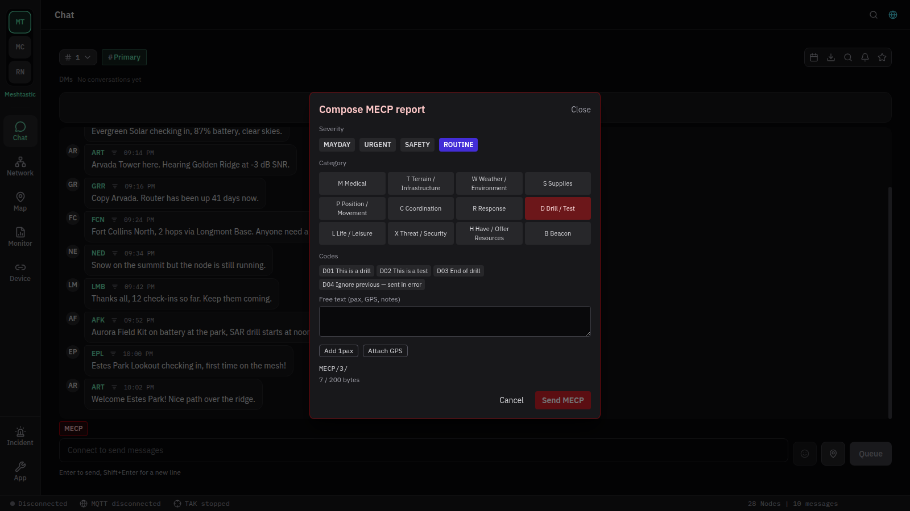

---
hide:
  - navigation
---

# Mesh Hub

**One desktop app for Meshtastic and MeshCore mesh networks** on macOS, Linux, and Windows. Connect over Bluetooth, USB serial, Wi-Fi/TCP, or MQTT, keep your full message history locally, and see what your mesh is actually doing with built-in routing diagnostics.

[Download Mesh Hub](https://github.com/charlottemeshtastic/mesh-client/releases/latest){ .md-button .md-button--primary }
[Install guide](install.md){ .md-button }
[All features](features.md){ .md-button }

> [!NOTE]
> **Volunteer-run.** Mesh Hub is a community fork of [Colorado-Mesh/mesh-client](https://github.com/Colorado-Mesh/mesh-client), focused on Meshtastic and MeshCore. Bug reports, testing on real radios, translations, docs, and code all help. See [Contributing](contributing.md).

## Pick your mesh

### Meshtastic

Connect a Meshtastic radio over BLE, USB serial, HTTP, or TCP, or join over MQTT. Channels, DMs, remote admin, telemetry, Store & Forward, and routing diagnostics.

[Meshtastic features](features.md#meshtastic-features) · [Troubleshooting](troubleshooting.md)

### MeshCore

Companion radios over BLE, USB serial, or TCP. Contacts, channels, Rooms (BBS), repeater admin (status, neighbors, trace, CLI), and MQTT chat ingest.

[MeshCore features](features.md#meshcore-features) · [Troubleshooting](troubleshooting-meshcore.md)

## Highlights

- **Persistent history:** every message, node, and contact is stored in a local SQLite database, so nothing disappears when you reconnect.
- **Routing diagnostics:** spot problem relays, hidden terminals, noisy channels, and unstable paths. See [Diagnostics](diagnostics.md).
- **Maps that work offline:** download map regions ahead of time for field use. See [Troubleshooting: Map tab without internet](troubleshooting.md#map-tab-without-internet-offline--no-wan).
- **Emergency communications:** MECP emergency reports, Incident Command, and TAK (Cursor-on-Target) on both protocols. See the [EMCOMM guide](emcomm.md).
- **Your language:** the interface is available in 16 languages and works fully offline. See [Localization](localization.md).

## Get help

- **Something not working?** Start with [Troubleshooting](troubleshooting.md) or the [MeshCore](troubleshooting-meshcore.md) page.
- **Reporting a bug:** use **App → Export for GitHub** and attach the file. See [Reporting bugs](troubleshooting.md#reporting-bugs-export-for-github-app-tab).
- **Unfamiliar term?** Check the [Glossary](glossary.md).
- **Talk to people:** [GitHub issues](https://github.com/charlottemeshtastic/mesh-client/issues).

## Frequently asked questions

### Is there a way to add a hashtag channel?

Yes. When adding or editing a channel in the **Radio** tab, click **"Derive from name"** and make sure the channel name includes the `#` prefix (e.g., `#general`). This generates the PSK from the SHA-256 hash of the name with the leading `#`.

### macOS says the app is damaged or crashes at launch after unzipping

Prefer the **`.dmg`**. If you use the **`.zip`**, extract it with **[Keka](https://www.keka.io/en/)** or `ditto -xk`, not 7-Zip. See [Troubleshooting: Squirrel.framework](troubleshooting.md#macos-library-not-loaded-squirrelframework-after-zip-extract).

## Protocol scope

Mesh Hub focuses on RF mesh (LoRa and related). Additional protocols are in scope when they support that RF mesh path; internet-only stacks are out of scope. Mesh Hub is for everyone, everywhere, not only licensed amateurs. See [README: Why](https://github.com/charlottemeshtastic/mesh-client/blob/main/README.md#why).
