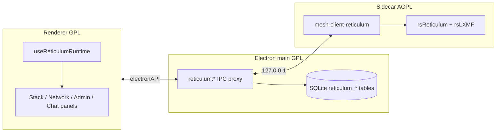
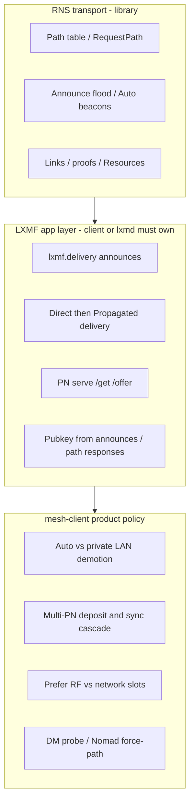

# Reticulum development

Developer and maintainer notes for the Reticulum integration: process architecture, the ownership split between RNS, LXMF and mesh-client policy, building the sidecar, and interop smoke tests. The user guide is [Reticulum in mesh-client](reticulum.md); the HTTP/WebSocket contract is [Reticulum sidecar IPC](reticulum-sidecar-ipc.md).

## Architecture



The renderer **must not** call the sidecar URL directly (sandbox). All HTTP/WS goes through main-process `reticulum:proxyGet` / `proxyPost` / `proxyPut` / `proxyDelete`. Paths must start with `/api/v1/`. Full route list: [reticulum-sidecar-ipc.md](reticulum-sidecar-ipc.md).

**Listen-first connect:** The sidecar binds HTTP first, then `attach_live` brings up RNS/LXMF (path table, BLE Peer, deferred PN messagestore). Electron health is `GET /api/v1/status` with `status: "ok"` — not `rns_ready` / `lxmf_ready`. `useReticulumRuntime` marks connection **configured** once start succeeds and identity is known, then hydrates peers/DB in the background and dispatches `RETICULUM_CONFIGURED_EVENT`. TCP hubs and RRC can proceed after live attach; Chat LXMF send/reaction fail closed with `requires live rns-stack sidecar` until the bridge is up. **Cancel** / stop does not wait on cargo or BLE. LoRa Meshtastic/MeshCore may call `ensureForBle()` so GATT is available without a Reticulum UI Start. Renderer LXMF/RRC proxy sends use a **15 s** IPC deadline (`RETICULUM_IPC_SEND_TIMEOUT_MS`).

### Ownership: RNS vs LXMF client vs mesh-client policy

Reticulum is not one blob that “does everything automatically.” Before adding sidecar or UI automation, classify the work:



| Layer                                                 | Owns                                                                                                                                                                                                            | mesh-client role                                                                                                                                                                                                                                                                                                                                                                            |
| ----------------------------------------------------- | --------------------------------------------------------------------------------------------------------------------------------------------------------------------------------------------------------------- | ------------------------------------------------------------------------------------------------------------------------------------------------------------------------------------------------------------------------------------------------------------------------------------------------------------------------------------------------------------------------------------------- |
| **RNS transport** (rsReticulum)                       | Path table, announce flooding, AutoInterface beacons, RMAP discovery announce signing, Links / proofs / Resources                                                                                               | Call transport APIs (`RequestPath`, path table reads, destination register). Do **not** reimplement pathfinding or beacon loops in the sidecar or UI. Library gaps belong in overlays under [`reticulum-sidecar/patches/`](../reticulum-sidecar/patches/README.md), not a second routing plane.                                                                                             |
| **LXMF client / PN** (rsLXMF + sidecar orchestration) | `lxmf.delivery` announce schedules, Direct→Propagated outbound driver, identity learning for LRPROOF, local PN serve (`/offer`/`/get`), client inbox retrieve                                                   | Intentional **lxmd / Ratspeak parity**. rsLXMF is a library, not a full daemon — the sidecar owns these loops (`lxmf_delivery.rs`, `lxmf_outbound.rs`, `propagation_*`, `pn_inbound.rs`). Without them, Chat and offline delivery do not work. Documented elsewhere as “Host PN fabric → Chat (lxmd-style glue)”: mesh-client is PN + end-client on rsLXMF, **not** a second `lxmd` binary. |
| **mesh-client product policy**                        | AutoInterface demotion toward private TCP/UDP, multi-slot path failover before PN fallback, prefer path medium, multi-PN deposit/sync cascade (Off/Auto/Manual), Chat DM auto-probe, Nomad `force_path_refresh` | **Not** required by bare RNS. Exists for multi-hub / Auto+LAN / UX. Treat as intentional product behavior; do not mistake it for transport.                                                                                                                                                                                                                                                 |

**Renderer rule:** UI mirrors sidecar events and configures policy (announce interval, Propagation mode, Path/Probe buttons, RMAP publish toggles, topology layout). It must not invent peer discovery, announce flooding, or a second pathfinder. Optimistic `announce.received` peer rows and Topology graphs are **views** over the RNS path table, not routing.

**What looks “automatic” but is correct to own in the sidecar**

- Periodic / startup **LXMF delivery** announces and Network **Announce now** (Ratspeak/lxmd parity; see Network tab).
- `LxmfOutboundDriver` Direct planning, path-request gating, retries, then Propagated cascade.
- PN hosting admission, peer `/offer` bookkeeping, silent `/get` catch-up, and renderer Auto/Manual **sync cascades** that call into those APIs.
- Registering announce/path-response handlers so Direct LRPROOF has peer public keys.

**What is product policy above RNS** (keep intentional; cite when changing)

- [`auto_path_policy.rs`](../reticulum-sidecar/src/stack/auto_path_policy.rs) — RNS correctly prefers 0-hop Auto; sidecar demotes unhealthy Auto toward a live **private** path for LXMF Direct (see [Path routing](reticulum.md#path-routing)).
- [`path_failover.rs`](../reticulum-sidecar/src/stack/path_failover.rs) + path-medium overlays — ranked slots / medium preference before giving up Direct.
- [`pn_cascade.rs`](../reticulum-sidecar/src/stack/pn_cascade.rs) + [`reticulumPropagationAutoApply.ts`](../src/renderer/lib/reticulum/reticulumPropagationAutoApply.ts) — multi-PN deposit and sync order.
- Chat DM auto-probe (`useReticulumDmPathProbe`) — reachability UX; RNS would still path on send.
- Nomad `force_path_refresh` — DropPath→RequestPath recovery for stale TCP hub paths.
- Nomad per-node **identify** (default **anonymous**) — Link sessions send `LINKIDENTIFY` only for nodes the user opted in; RNS itself has no such default. See [Nomad identify](reticulum.md#nomad-identify-to-this-site).

**Gate for new automation:** Is this RNS transport, LXMF client/PN (lxmd parity), or mesh-client policy? Prefer library/overlay for transport; prefer sidecar lxmd-shaped loops for LXMF; prefer explicit, documented policy modules for product overrides — never a parallel path table or announce flood in the renderer.

**Duplication vs ownership (send / path / propagation):** Extra sidecar (or renderer) code is not automatically “Ratspeak duplicated.” Classify before deleting or relocating:

| Area              | Upstream-owned                                                               | mesh-client-owned (keep)                                                                                                                                                                         | Suspicious duplication (do not add)                                      |
| ----------------- | ---------------------------------------------------------------------------- | ------------------------------------------------------------------------------------------------------------------------------------------------------------------------------------------------ | ------------------------------------------------------------------------ |
| **Send pipeline** | LXMF wire, Direct outbound driver, terminal `lxmf_outbound_status` Completes | Renderer outbox drain, optimistic pending→hash rekey, SQLite `delivery_status`, badge semantics (`sending` vs recipient **Delivered** vs PN deposit). `POST /lxmf/send` enqueue is not delivery. | A second outbound driver or treating HTTP send `ok` as recipient receipt |
| **Path policy**   | RNS path table, `RequestPath`, announce flood                                | `auto_path_policy.rs`, `path_failover.rs`, path-medium preference/pins — product policy on the RNS table                                                                                         | A parallel pathfinder or announce loop in sidecar or UI                  |
| **Propagation**   | PN `/offer`/`/get` wire (rsLXMF)                                             | Sidecar LXMF/PN loops (lxmd parity) plus `pn_cascade.rs` / Auto-discovered candidates / Off·Auto·Manual sync order (`reticulumPropagationAutoApply.ts`)                                          | A second messagestore or PN protocol implementation                      |

False **Delivered** on RF-only Chat is typically **renderer correlation** (outbox vs store row), not missing Ratspeak send logic. Correlate receipts to the attempt’s optimistic id/hash (`useChatOutbox.ts`); do not “fix” it by moving UI status into the sidecar.

---

## Building the sidecar (development)

`rns-stack` builds need the repo-local `.rsstack/` workspace checkouts `rsReticulum`, `rsLXMF`, `rsNomad`, `rsLXST`, and `lrgp-rs` (see `scripts/clone-ratspeak-stack.sh`). That script floats each to `origin/main` by default (optional bisect with `RS_RETICULUM_REF` / `RS_LXMF_REF` / `RS_NOMAD_REF` / `RS_LXST_REF` / `RS_LRGP_REF`) and applies mesh-client overlays for rsReticulum/rsLXMF (fails if a patch will not apply). Open upstream feature PRs such as [rsReticulum#26](https://github.com/ratspeak/rsReticulum/pull/26) and [rsLXMF#7](https://github.com/ratspeak/rsLXMF/pull/7) are carried as overlays (not SHA pins) — tracked by `pnpm run update`. Peer list / detail default avatars use [LXMFace](https://github.com/ratspeak/LXMFace) (`src/renderer/lib/reticulum/lxmface.ts`) when no custom Lucide icon is set.

End users of **GitHub Releases** or **Flatpak** do not need Rust. Developers and contributors do.

**One command** (from repo root; requires [Rust](https://rustup.rs/)):

```bash
pnpm run reticulum:sidecar:build
```

Cargo always needs the `.rsstack/` checkouts (`rsReticulum`, `rsLXMF`, `rsNomad`, `rsLXST`, `lrgp-rs`) as path dependencies — clone them with `./scripts/clone-ratspeak-stack.sh` (same as [reticulum-sidecar/README.md](../reticulum-sidecar/README.md)). With those trees present, the build script applies required patches and compiles with **`rns-stack,rns-ble,rns-rnode-tcp`** for the **real mesh-I/O** stack (live path table, BLE, RNode USB/Wi‑Fi, Nomad hosting, LXST voice, LRGP games). Building **without** `--features rns-stack` still uses those checkouts but links the **stub** stack (file-backed API for UI/tests — not for real mesh I/O).

**Electron dev:** **Start stack** auto-runs `cargo build` when the debug binary is missing, when `reticulum-sidecar/src/**/*.rs` or `Cargo.toml` is newer than the binary, or when a stub binary is present but the full `.rsstack/` workspace exists. First compile can take several minutes — pre-build with the command above.

**Run sidecar alone:**

```bash
pnpm run reticulum:sidecar:dev
curl -s http://127.0.0.1:19437/api/v1/status
```

CI matrix (stub + full stack): [`.github/workflows/reticulum-sidecar.yaml`](../.github/workflows/reticulum-sidecar.yaml). Flatpak release builds bundle the full-stack binary into `resources/reticulum-sidecar/`.

Patch overlays (packet tap, AutoInterface utun, discovery-announce-egress, rsLXMF policy-setters, …): [`reticulum-sidecar/patches/README.md`](../reticulum-sidecar/patches/README.md).

---

## Remote (rnsh / rncp) interop smoke

Wire protocols are stock Reticulum utilities — mesh-client is a client (and rncp receive listener), not a private dialect.

| Scenario       | Peer side                                                         | mesh-client side                                                                                                                                              |
| -------------- | ----------------------------------------------------------------- | ------------------------------------------------------------------------------------------------------------------------------------------------------------- |
| Shell          | `rnsh` / `rnsh-rs` listen; allow our identity (`-a` / allow-list) | Remote → Shell → paste `rnsh` destination hash → connect                                                                                                      |
| Send file      | `rncp -l -a <our_identity>` (or mesh-client inbound Ask)          | Remote → Transfer / Chat DM → peer `rncp.receive` hash (not LXMF)                                                                                             |
| Receive file   | `rncp file <our_receive_hash>`                                    | Remote → Settings → inbound Ask/allow-list; copy **My rncp receive destination**                                                                              |
| Fetch          | Peer `rncp -l -F -j <jail> -a <our_id>`                           | Remote → Transfer → Fetch remote path                                                                                                                         |
| Auth fail      | Peer allow-list omits us                                          | Error shows **not allowed** + copy our identity hash                                                                                                          |
| Request enable | Second mesh-client                                                | Chat/Transfer **Request enable** (`mesh-client:request-rncp-receive:v1`); peer replies with `mesh-client:rncp-receive-dest:v1:<hash>` so the sender autofills |

Transfers require a **high-speed** path (TCP/network); LoRa/BLE-only destinations are refused locally before a link opens. There is no byte-level resume — Retry restarts the full file.

## Code map

File-level detail for the Reticulum sidecar, LXMF, propagation, Remote (rnsh/rncp), Nomad, RRC, voice, and games. Related: [reticulum.md](reticulum.md) (user guide), [reticulum-sidecar-ipc.md](reticulum-sidecar-ipc.md), [troubleshooting-reticulum.md](troubleshooting-reticulum.md).

- **Ownership (do not reimplement transport):** Reticulum automation has three layers — (1) **RNS transport** (path table, announce flood, Auto beacons, Links/proofs) stays in rsReticulum (+ overlays under `reticulum-sidecar/patches/`); (2) **LXMF client/PN** loops (delivery announces, Direct→Propagated driver, identity-from-announce, PN `/offer`/`/get`) are intentional **lxmd/Ratspeak parity** owned by the sidecar because rsLXMF is not a daemon; (3) **mesh-client policy** (Auto→private demotion, multi-PN cascade, path-medium preference, DM auto-probe, Nomad `force_path_refresh`) is product behavior above RNS — document it, do not mistake it for transport. Renderer mirrors WS/HTTP and configures policy; it must not invent pathfinding or announce flooding. Extra sidecar send/path/PN code is usually **lxmd glue or product policy**, not accidental Ratspeak duplication; Chat outbox/badge receipt correlation stays in the renderer. Full write-up: [Ownership](#ownership-rns-vs-lxmf-client-vs-mesh-client-policy).
- **Sidecar:** `reticulum-sidecar/` (AGPL Rust binary `mesh-client-reticulum`; path deps under repo-local `.rsstack/` via `scripts/clone-ratspeak-stack.sh` — `rsReticulum`/`rsLXMF`/`rsNomad`/`rsLXST`/`lrgp-rs`); dev: `pnpm run reticulum:sidecar:dev`. **Listen-first:** HTTP binds before `attach_live`; `/api/v1/status` `status: ok` = listening; `rns_ready`/`lxmf_ready` false until live. PN messagestore load deferred; local-prop serve waits for load. LXMF send/reaction fail closed with live-required errors until live.
- **IPC:** `reticulum:*` main handlers — `start` / `stop` / `getStatus` / `syncInterfaceIssueScope`, `proxyGet` / `proxyPost` / `proxyPut` / `proxyDelete`, **`factoryReset`** (blocked on generic proxy), config file read/import dialog, `showNomadContentSourceDialog`, `setNomadContentSource`, Remote `rncpSend` / `rncpFetch` / `setRncpListener` / `showRncpOpenFileDialog` / `showRncpSaveDirectoryDialog` / `revealInFolder`. Also `media:ensureCameraAccess`, `gps:exportGpx`, `db:setReticulumDestinationVerified`, Remote DB `db:listReticulumRemoteAddresses` / upsert / delete and `db:listReticulumInboundPolicy` / upsert / delete (`src/main/ipc/reticulum-db-handlers.ts`), `mesh-client:openUrl` / `electronAPI.deepLink.onOpenUrl`. Renderer uses `electronAPI.reticulum` proxy (no direct localhost). Proxy rate-limit soft-envelopes live inside the handler `try` (`settleReticulumProxyFailure`). `ReticulumStackPanel` + `useReticulumInterfaceSnapshot` sync enabled interface names after hydrate so TCP/TX issue banners clear when hubs are disabled — **do not** refresh interfaces on `announce.received` / `stats_update` (that flooded `GET /interfaces` after wake); poll + shared proxy backoff only. `reticulumSidecarIssueTracker` keeps that enabled set sticky while reading sidecar logs; latches named TCP RST/EOF for Connection alerts. **TCP hub fast-flap (RNS 1.4.0+):** `reticulumStackSessionTracker` counts stack starts (five in 12h, persisted; testers with long sessions still qualify); Connection amber banner uses `tcp_fast_flap` / unreachable+restart hint; auto stack restart is skipped; host TCP probes run only before sidecar ready. [troubleshooting](troubleshooting-reticulum.md#reticulum-public-hub-tcp-blocked-fast-flapping-client).
- **Panels:** `ReticulumStackPanel` (Connection — stack lifecycle, interfaces, issue banner), `ReticulumNetworkPanel` (Network — identity **slots** + QR share/ingest, stack/announce settings, Propagation mode Off/Auto/Manual + rename/delete, config import), `ChatDmPaperControls` (Chat DM **Share as paper** + **Scan paper**), `ReticulumMapPanel` (Map — RMAP v4 discovery), `ReticulumRmapDiscoveryControls` / `ReticulumRmapConnectionStatus` (RMAP publish: Network enable-all eligible interfaces; Connection **X of Y** status), `ReticulumAdminPanel` (Admin — RNode flasher, factory reset), `ReticulumPeerListPanel` (Peers — **Peers / History / Contacts / Favorites** sub-tabs; path request + probe + verified badge; LXMFace avatars; History = messaged `last_heard`, Contacts = explicit `is_contact` / Save as contact only), `NomadNetworkPanel` (Nomad — browse + **My Pages** watched-folder static host via `NomadPageServerPanel`/rsNomad; `nomad_serving_enabled` + `nomad_serving_content_source` restore hosting after live stack start; lazy-mount keep-alive, dual-axis page scroll; fit-width default and open-width toggle), `ReticulumRemotePanel` (Remote — rnsh multi-session shell + rncp send/receive/fetch; Saved addresses + inbound policy; Chat DM send-file via `ChatDmRncpControl`), `RrcPanel` (RRC — multi-hub relay chat)
- **Deep links / QR:** OS scheme is **`lxm://`** (not `mesh-client://`); `MeshClientDeepLinkHost`, `meshClientDeepLink.ts` (`lxmPaperMessage` kind + `looksLikeLxmPaperBlob`; Games `lxm://game/<session>` / Ratspeak `lrgp:<session>` → `lxmGameSession`), `handleReticulumQrIngest.ts` (shared Network/Chat/OS paper + in-app contact ingest), `applyLxmPaperIngest` → `POST /api/v1/lxmf/paper/ingest`, `QrIngestControl` / `QrCodeImage`. OS contact / MeshCore imports confirm before upsert; **paper OS deep links ingest without confirm**; Games session links open Reticulum Games tab via `openReticulumGameSession`.
- **Decommissioned hubs:** `src/shared/reticulumDecommissionedHubs.ts` (Amsterdam only) — stack-start auto-disable + **Add default backbones** disables matching enabled TCP rows; UI badge + enable-block in `ReticulumInterfacesPanel.tsx` (`isDecommissionedReticulumTcpInterfaceRow`); keep TS↔Rust synced via `pnpm run check:reticulum-decommissioned-hubs`. Default backbone picker + region-grouped interface list (Primary & Global / North America / Europe / Asia & Oceania / Specialty / User Defined) in `reticulumDefaultHubPresets.ts` + `ReticulumDefaultHubsPickerModal.tsx`; muted disabled rows + checkbox bulk delete; `countEnabledDefaultHubPresets` / >3 enable warning
- **BLE RNode RSSI:** Prefer `InterfaceRow.host_rssi` (sidecar connect/scan cache) over advertisement polls; `useReticulumBleRnodeRssiMap` gates on sidecar **running** (not api-ready), burst-then-steady scans via nested `acquireReticulumBleScan`, matches scan `address` and friendly `name`, clears sticky targets immediately when all BLE RNodes are disabled
- **Propagation mode / sync:** Network → Propagation nodes owns Off/Auto/Manual (default **Off**; persisted values including legacy App-panel `auto` are honored). Auto one-time syncs via `startPropagationSyncCascade` + sidecar `destination_hash` sync in order: **finite-hop discovered** (no Add/Preferred) → **configured remotes** → **unknown-hop discovered** → local-prop (skips remotes when no enabled interfaces); runtime hook `useReticulumPropagationAutoSync`. Sidecar `start_propagation_sync` is **client `/get`-primary** (inbox retrieval; UI progress from `PropagationClient`) — peer `/offer` inventory push stays on the local-host peer loop when serving (avoids AwaitingResponse hangs against non-peer remotes with a nonempty messagestore). Hard-fails with `PROPAGATION_PATH_UNKNOWN` when `ensure_path_for_direct` fails after announce settle (same path gate as offer probe). Manual uses Preferred, else picks the best configured remote **for that sync only** (no Preferred write), then the remaining remotes, then local-prop. Off = **no PN support**: `startPropagationSyncCascade` returns early (per-row Sync is disabled in UI), `hasEffectiveReticulumPropagationTarget` / `hasReticulumPnCascadeCapacity` are false, `ReticulumPropagationNotice` is hidden, and the sidecar disarms the outbound PN plus empties cascade candidates (`propagation_mode` in `mesh_client_stack.json`, `POST /api/v1/propagation/mode`, `candidates_for_propagation_mode`); renderer pushes the mode on change and on sidecar-ready. **Ignore for Auto:** `POST/DELETE /api/v1/propagation/auto-blacklist` persists `propagation_auto_blacklist` (32-hex, cap 256); filters Auto sync ranking **and** Auto deposit (`auto_discovered_candidates` + configured retain in Auto); Manual Prefer/Sync still allowed. Ownership: mode in renderer localStorage (+ sidecar mirror); blacklist + deposit candidates in sidecar; sync cascade orchestration in `reticulumPropagationAutoApply.ts`; `startSync` attempt stamps must be unique across same-ms supersession. `reticulumPropagationStore` / `reticulumPropagationSync.ts` — Establishing stall (~45s) + hard ceiling (~180s), auto-sync interval from last success with failure cooldown, error keys for identity / non-PN / path-unknown / peering stamp; stamps `lastPropagationSyncAttemptAt` / `activePropagationSyncAttemptAt` for WS correlation. Cancel mid-`/get` must call `PropagationClient::abort_transfer` (rsLXMF overlay) or the next Sync stays `PROPAGATION_RETRIEVE_BUSY`. Silent Host `/get` terminal clear must only drop the latch when `propagation_sync_target` still equals that peer. **Nothing-to-sync is not a failure:** when the cascade contacts no node it writes `syncNoTarget` / `syncLocalLoading` / `syncRetrieveBusy` (never overwriting a real error from an attempted node), the local row reports sidecar `status: "loading"` while the messagestore reads (`local_propagation_status` + `PropagationBridge::messagestore_load_pending`, per-row Sync disabled), and the 30 s tick calls `refreshFromSidecar` while `hasPropagationCascadeCandidate` is false so a fresh stack recovers on its own — `refreshFromSidecar` must **not** clear the active attempt while `sync.active`. Debug snapshot `propagationClient` exposes mode/preferred/autoTarget/resolvedSyncTargetId/autoBlacklist. **Auto also deposits on Discovered PNs:** sidecar `auto_discovered_candidates` (`pn_cascade.rs`, Auto only, cap 3, hop-sorted with `MAX_PLAUSIBLE_PROPAGATION_HOPS=32`, skips inactive / self / already-configured / Auto-blacklist / over `max_peering_cost`) appends after configured remotes and before local-prop, rebuilt from the shared `rebuild_pn_cascade_candidates` helper in `live.rs`; capacity helpers count non-blacklisted discovered rows in Auto. **Chat notice dismiss:** `chatNoticeDismissed` with **Don't show again** / Network toggle. **Named sync target:** `startSync` stamps `syncTargetId`. **Attempts settle before the cascade advances:** `startSync` returns `accepted` | `deferred` | `failed`. Soft-defer (`PROPAGATION_SYNC_OUTBOUND_BUSY` / `PROPAGATION_RETRIEVE_BUSY` / `PROPAGATION_STACK_NOT_LIVE`) advances **without** 15‑min backoff; all-remote soft-defer + local-only settle must **not** advance `lastPropagationSyncAt` as a full success. Remote budget `PROPAGATION_CASCADE_BUDGET_MS` (5 min); per-attempt ~60s; single-flight cascade. Auto `/api/v1/interfaces` probe **fails closed** (treat read/rate-limit as no interfaces → local-only settle). **Retrieval vs peer sync:** User Sync progress is **client `/get`-primary**. Peer `/offer` runs only on the **local Host peer loop**. Logs: `propagation-retrieve` (`retrieve_mode=get|get_post_peer|get_periodic|local`); peer-offer `propagation-sync … peer_outcome=*` (**not** retrieval). `local-prop` Sync uses `drain_local_inbox` and returns `PROPAGATION_STACK_NOT_LIVE` when live is absent.
- **Host PN fabric → Chat (lxmd-style glue):** When local Host is enabled, mesh-client is both PN and end-client on rsLXMF (not a second lxmd). Path: outbound deposit → host peer `/offer` push (generation-gated; lxmd terminal bookkeeping: `sync_complete` / `mark_offer_generation_processed` / `take_handled_updates` + `save_peer`); inbound peer Resource accept → `request_inbox_drain` → maintenance `drain_local_inbox` → `delivery_callback` → Chat; after host peer `/offer` Completes for peer `P`, sequenced **silent** client `/get` (`retrieve_mode=get_post_peer`); while serving and quiet, **~90s** periodic silent `/get` round-robin over peered remotes (Prefer/outbound first, `retrieve_mode=get_periodic`) for inbox catch-up — not a timed empty re-`/offer`. Re-`/offer` when `offer_generation` advances, offer policy changes, or a partial sync left work; maintenance polls every ~2s but only _starts_ work when idle. Guards: coalesce drain; one internal `/get`; skip when user Sync target / outbound deposit owns the hash or `sync_active` / `client_download_active`. Do **not** re-attach peer `/offer` to the Sync button. Dual full-index exchange in one Link stays upstream rsLXMF; remote inventory for re-propagation arrives when peers `/offer` to our serve path.
- **PN hosting:** Network **Advanced PN hosting** / `ReticulumPnHostingDangerZone`; shared `pnHostingPolicy.ts` + sidecar `pn_hosting_policy.rs` / `pn_hosting_apply.rs`; `POST /api/v1/propagation/hosting-policy`; rsLXMF policy-setters overlay ([ratspeak/rsLXMF#6](https://github.com/ratspeak/rsLXMF/pull/6)). Messagestore loads in background on live attach; enabled `local-prop` serve/announce waits until load completes.
- **Interface modes:** rnsd `mode` via `reticulumInterfaceMode.ts` + sidecar `normalize_interface_mode` (keep catalogs in sync — `pnpm run check:reticulum-interface-modes` in pre-commit/`release.sh`); add defaults TCP/UDP/I2P → `boundary`, Backbone → `gateway`, RNode → `access_point`; UI in `ReticulumInterfacesPanel`; default hub presets add/repair missing mode to `boundary` (do not overwrite valid non-boundary). Discoverable + Full/Roaming/Boundary stamps `ignore_config_warnings = Yes` (`reconcile_ignore_config_warnings` / `repair_ignore_config_warnings_in_config`) so RNS does not auto-correct runtime mode to Access Point; Connection shows **Effective: Access Point** when live `runtime_mode` still diverges. See [../reticulum.md#interface-modes](reticulum.md#interface-modes) and [../reticulum.md#rmap-publish-and-interface-mode](reticulum.md#rmap-publish-and-interface-mode).
- **RMAP publish allowlist:** `isReticulumRmapDiscoveryCapable` — RNode / KISS / AX.25 KISS (with port), I2P, Backbone only (rsReticulum advertizable types). Not UDP/pipe/ble_peer/rnode_multi/TCP clients. Backbone requires `reachable_on`. Share instance ≠ public gateway.
- **RMAP consume:** Map listens via forced `discover_interfaces=Yes`; Network stack settings expose opt-in `autoconnect_discovered_interfaces` / sources / stamp / `network_identity` (defaults safe). Map can **Add as interface** for Backbone/TCPServer with host:port. Do **not** implement `autoconnect_interface_mode` / `autoconnect_announces_to_internal` in mesh-client — library gaps in rsReticulum. `bootstrap_only` is a typed interface field.
- **Share instance defaults:** missing keys bootstrap to `share_instance = No` / `instance_name = mesh-client` (does not overwrite explicit Yes/`default`).
- **Never a shared-instance client (issue #1181):** `stack/instance_policy.rs` starts with `SharedOwner` (Share on) or `Standalone`; a taken endpoint falls back to Standalone and sets `shared_instance_conflict` (`/api/v1/status`, `shared_instance_conflict` audit, `ReticulumSharedInstanceConflictBanner`). Ratspeak overlays (path-medium, RF rebroadcast exclusion, RMAP egress, BLE RNode/Peer) need transport ownership, so attaching to system rnsd is declined. Every user notice renders `ReticulumSystemRnsExplainer` (reason + docs anchor `using-mesh-client-with-other-reticulum-apps`). Reverse direction: `GET /api/v1/stack/shared-instance` → `ReticulumShareForOtherApps` snippet. Setup guide probes system rnsd read-only via `reticulum:detectSystemInstance` (`src/main/reticulum-system-instance.ts`). `disable_share_instance` repair; offline lint via `reticulum:validateConfig` / Network **Check config** / `pnpm run reticulum:config:check`
- **LXMF replies:** sidecar stamps `FIELD_REPLY_TO` / capped `FIELD_REPLY_QUOTE` before sign; renderer ingest/Chat use `reticulum_reply_to_hash` + quote preview + jump-by-hash
- **RNode flasher timeouts:** `RNODE_COMMAND_TIMEOUT_MS` (30 s serial), `RNODE_BT_PAIRING_TIMEOUT_MS` (90 s BLE pairing), `ESP32_FLASH_STALL_TIMEOUT_MS` / `NRF52_DFU_STALL_TIMEOUT_MS` (60 s no-progress → `ESP32_FLASH_STALLED` / `NRF52_DFU_STALLED`); humanized via `flasherErrorHumanize.ts`
- **Peer aliases / History vs Contacts:** LXMF/Nomad announce names overlay path-table peers; SQLite `reticulum_destinations.last_heard` = History, `is_contact` = Contacts (Save as contact only — inbound/outbound LXMF does **not** auto-add Contacts; sidecar `/contacts` wire rows are History hints unless SQLite `is_contact=1`); default avatars via vendored LXMFace (`lib/reticulum/lxmface.ts`); renderer refresh + `reticulumContactToNodeRecordPreservingLabel` refuse hash-prefix wipes of Chat/`nodeStore` labels; ingest stamps History via `persistReticulumHistoryFromPayload` + `stampHistoryPeer`; SQL upsert guard preserves real names over hash-prefix aliases; destination upsert requires exact 32-hex (lowercase) and omits `favorited` on icon-only patches so favorites/icons survive path/probe refresh. **Chat DMs are `lxmf.delivery` only** — `resolveReticulumChatLxmfDest.ts` remaps `lxst.telephony` (and other non-lxmf path-table rows) to that identity’s LXMF hash via identity activity; Peers Message / paste / send refuse when no LXMF announce is known (Voice badge on telephony-only rows). Existing open/active DM tabs canonicalize onto the LXMF fold when remapped (`remapReticulumChatDmTabs.ts`); filters/unread alias remappable aspects via `reticulumChatDmNodeIdsEquivalent`.
- **RRC `/who`:** `RrcPanel` sends `/who <room>` **with `K_ROOM` set to the joined wire room** (Python rrc-web parity; slash commands are handled before forward so this is not room chat). Never `/who` synthetic `[hub]` / `@dm` rooms. Empty inbound `K_ROOM` → `[hub]` (`resolveRrcInboundChatRoom` / `RRC_HUB_STREAM_ROOM`), never the focused room. First `/who` NOTICE per named room may appear in the transcript (`consumeWhoTranscriptSlot` / `shouldShowRrcWhoTranscript`); later snapshots update the nicklist only. User-initiated Refresh / composer `/who` bypasses that slot. Stock rrcd `emit_notice` for `/who`/actor JOINED is a single `Packet.send` (no chunk/resource): if the roster exceeds Link MDU (typically 431) the hub drops it silently — observed on RNS Community `28c7…` with MDU 431 while Colorado Mesh who (~300 B) succeeds. Nicklist then grows from fanout JOINED + opportunistic chat; join-info NOTICE still seeds self into the roster when actor JOINED never arrives. Drop detection uses `whoReplyPendingRooms` (set on send, cleared on any parsed `/who` including `(none)`): a ~12s no-reply prints `rrc.whoReplyMissing` even when join-info already seeded self — not a roster-empty heuristic.
- **EX1-RRCD client parity:** Advertise `CAP_RESOURCE_ENVELOPE` / `CAP_ACTION` / `CAP_DIRECT_NOTICE` in HELLO; accept `T_RESOURCE_ENVELOPE` (50) with SHA256 verify + notice/motd dispatch (blob ignored); parse WELCOME hub version + limits; JOINED bodies as full list **or** single/bare hash with advisory `K_NICK` on fanout (merge, never wipe on empty); peer `PARTED` updates nicklist via `rrc.room.peer_parted`. Full busy-room roster still requires a hub that chunks `/who` (Ratspeak `push_notice_entries`) or uses `send_text_smart`. Ratspeak `/list` may also arrive as chunked NOTICEs (header alone, then one indented room row per packet) — `beginListedRoomsDirectory` / `appendListedRooms` accumulate into the ROOMS sidebar; single-packet rrcd `/list` still uses `setListedRooms` replace.
- **RRC layout (v6):** `RrcPanel` renders through `chat/ConversationLayout`: one list column with a **Rooms / Hubs** segmented switch (`RrcRoomSidebar` / `RrcHubBrowser` are column bodies; Rooms is disabled until a hub is linked; choice in `mesh-client:rrc:listView`), a single conversation header (room or hub title, status dot, hub, topic, member count, icon toggles, Members toggle, Disconnect), and `RrcNickList` as a side panel docked at 1280px and wider and a sheet below that. The list column hides only when both legacy keys `mesh-client:rrcHubListCollapsed` and `mesh-client:rrc:roomListCollapsed` are set (toggling writes both); members visibility on wide windows keeps `mesh-client:rrc:nickListCollapsed`. Under 768px the list and the conversation take turns (Back button).
- **RRC stick-to-bottom:** Owned by `RrcChatView` + shared `chatScrollUtils` (TanStack Virtual `followOnAppend` / pin ref); keep Chat/Rooms flex `min-h-0` + stream `[overflow-anchor:none]` parity so the message stream remains a real scroller.
- **Stores/lib:** `reticulumIdentityStore.ts` (session-global sidecar identity status shared by `useReticulumSidecarApi` — distinct from identity-scoped `identityStore`), `reticulumPeerStore.ts` (path-table `peers` + `history` + saved `contacts`; soft-TTL reads, forced `?refresh=1`, incremental `peers_updated` route-field patches, 50ms batching, name/appearance preservation, 30s/60s large-mesh poll), `reticulumDiscoveryMapStore.ts`, `reticulumRmapDiscovery.ts`, `reticulumDiscoveryMapLayout.ts`, `nomadNetworkStore.ts`, `rrcHubStore.ts` / `rrcSessionStore.ts` (RRC hubs + multi-hub sessions; hydrate/clear room history via `rrcRoomHistory.ts`; persist → SQLite `rrc_messages` via `rrcMessagePersist.ts` + `ipc/rrc-db-handlers.ts`; prefs in `rrcHubPrefs` / `rrcRoomPrefs` / `rrcRecentRooms`; notifications in `rrcInactiveNotifications` / `rrcMention` (`resolveRrcAlertType` + App `rrcUnreadAllRoomMessages`, default all-room, IRC mention/DM opt-out)); **Remote (rnsh/rncp):** `rncpTransferStore.ts`, `rnshSessionStore.ts`, `reticulumInboundPolicyStore.ts`, `reticulumRemoteAddressStore.ts`, `rncpEnableRequestStore.ts` + lib `remoteSettingsStorage.ts`, `pushRncpListenerPolicy.ts`, `rncpInboundPolicyLists.ts`, `sendRncpRequestEnable.ts`, `rncpRequestEnableRateLimit.ts`, `applyRncpReceiveDestShare.ts` / `rncpReceiveDestSharePending.ts` (mark pending on request-enable; consume on ingest within TTL), `hooks/useRemotePathCapability.ts`, `components/remote/*`; WS events `rmap.discovery`, `lxmf_outbound_status`, `nomadnetwork.node`, `rrc.*`, `rnsh.*` / `rncp.*` in `useReticulumRuntime` (sidecar also emits `nomad.serving_start` / `nomad.serving_stop`; renderer polls serving status via HTTP, not those WS events)
- **LXMF outbound delivery:** sidecar `lxmf_delivery.rs` / `lxmf_outbound.rs` / `pn_cascade.rs` (Direct-first; after Direct exhausts **multi-PN cascade**: preferred remote → other enabled remotes hop-sorted → in **Auto** only, up to 3 heard-but-not-added Discovered PNs hop-sorted → local-prop last; intermediate WS `sending` + `delivery_method: "propagated"` or `"stored_locally"`; terminal `delivered` at remote PN vs `stored_locally` for local hosted PN). **Local-prop** is a full PN (in-process cascade deposit via `accept_stamped_propagated_blob`; host peer `/offer` sync; auto Chat drain after peer ingress + post-peer silent `/get`; explicit local Sync via `drain_local_inbox`) — not an outbox; clients need not Prefer you. Propagated **link establishment timeout** advances the cascade when other PNs remain (avoids Prefer-hash timeout storms). Sync vs deposit: `PROPAGATION_SYNC_OUTBOUND_BUSY` / `PN_DEPOSIT_DEFER_ADVANCE_AFTER`. Renderer `applyReticulumOutboundDeliveryStatus.ts` (WS `lxmf_outbound_status` → Zustand + SQLite `delivery_status` + `delivery_method`; early-status buffer; hash/status allowlist), `reticulumOutboundFailureBridge.ts` (`shouldApplyLinkDeliveryTimeoutFailureBridge` skips the link-timeout Failed bridge when cascade capacity remains — remote **or** enabled local-prop; also skips `propagated` / `stored_locally` rows so cascade is not killed), `markStaleReticulumOutbound.ts`. Optimistic pending rows use `reticulum-pending-*`; send-path rekey passes `replaces_message_hash` on SQLite upsert to delete the prior pending hash. Remote PN Completes UI: **Stored at propagation node** (`ReticulumMessageStatusBadge` PN + green check); local-prop Completes: deposited on your hosted node (PN + amber house; peer sync may still propagate). Mode Off has no cascade capacity, so the link-timeout bridge fails the row. **Paper exception:** `createReticulumPaperMessage` / paper create Completes immediately (`delivery_method: paper`, `ReticulumMessageStatusBadge` **Paper**) via `lxmf_message` — no `lxmf_outbound_status`; shared `reticulumMessageTransport` / `reticulumPaperErrors` keep IPC allowlists and i18n codes aligned.
- **DM path reachability:** `useReticulumDmPathProbe.ts`, `reticulumDmPathReachability.ts`, `ReticulumDmPathReachabilityBadge.tsx` — Chat **Probe** matches Peer List (sidecar running check → `/probe` → toast → refresh); `applyProbeResult(forHash, …)` applies the settle without a second `/probe` and ignores stale completions after DM switch; manual reprobe forces Checking… even when passive hops look reachable; Peers virtualizes above 100 rows via `reticulumPeerListRows.ts`; peer refresh policy in `reticulumSidecarPeerRefreshEvents.ts`
- **Inbound transport labels:** `received_via` resolves the path-table interface name against local interface config type, so a TCP hub display name still renders as TCP.
- **Topology:** `via_hash` is an immediate transport id; sidecar synthesizes missing relay nodes. `ReticulumTopologyPanel` uses force layout; sidecar caps graph input at 2,000 peers, renderer ingest 800, drawn graph 400 after hop filters (same as LoRa Graph). Unknown hops only when All hops + Show distant. **RF only** checkbox keeps RNode/KISS/BLE spokes.
- **Retention:** defaults (destination age/count, message count, RRC room history) are documented in [../reticulum.md#app--retention--limits](reticulum.md#app--retention--limits). RRC prune wiring: `rrcMessageRetention*` settings and `db:pruneRrcMessagesByCount` / `db:pruneRrcMessagesByAge`.
- **Self label / header:** `reticulumSelfNodeLabel.ts` (`resolveReticulumSelfHeaderLabel` — Network display name in app header)
- **Nomad errors:** `lib/nomad/nomadPageErrorHumanize.ts` (sidecar error codes → i18n). Remote Nomad browse reuses one initiator `LinkSession` per dest (`live.rs` / `nomad_link_reuse.rs`) — do not go back to one-shot `LinkClient::query` per `/page` or `/media`. The cached Link is keyed on **destination and identify**: `LINKIDENTIFY` cannot be undone on an established Link, so reusing an identified Link for an anonymous request (or the reverse) would leak or drop identity — do not optimise the identify half of the key away.
- **Nomad identify (default anonymous):** per-node flag `NomadNodeRow.identify` persisted in sidecar state (`set_nomad_identify` / `clear_nomad_identify_all`, `POST /nomadnetwork/nodes/identify` and `/identify/clear`); turning it off calls `close_identified_nomad_link`. Renderer `nomadNetworkStore` passes `identify` from the stored flag on page/file/media fetches, clears that node's page/image caches on change, and `nomadPageViewerStore` includes it in the fetch dedupe key. UI: toolbar fingerprint toggle (confirm before enabling), list **Identifying** badge, header **Stop identifying**. My Pages **Access** edits `{page}.allowed` via `/serving/acl` (`nomad_page_acl.rs`), because rsNomad's page API rejects `.allowed` paths; self-preview bypasses ACLs. TCP-class inbound response Resources use overlay `rsReticulum-response-resource-window-fast.patch` (`WINDOW_MAX_FAST` when RTT ≤ 1s).
- **Nomad browser caches (renderer, in-memory only):** `nomadPageCache.ts` + `nomadImageCache.ts` (sizes and eviction in the user doc linked below). Not persisted; cleared by toolbar **⌀**, `closeViewer`, or process restart. Oversized entries are still displayed but never stored (next visit re-fetches). `forcePathRefresh` skips the image LRU. Host `NomadNodeConfig.media_cache` (rsNomad) is separate — serving only. See [../reticulum.md#nomad-browser-caches](reticulum.md#nomad-browser-caches).
- **Nomad request bodies:** MessagePack `field_*`/`var_*` encode/decode lives in rsNomad `nomad-core` (`encode_request_fields` / `decode_request_fields`); sidecar `nomad_request_payload.rs` only unwraps HTTP base64 JSON before calling encode
- **LXST voice:** `hasLxstVoice` gates Call buttons (Peers + Chat DM). Session helpers in `reticulumVoiceSession.ts` (dial/answer/hangup + mic PCM); UI store `reticulumVoiceStore.ts`; overlay `ReticulumVoiceOverlay` (App mount). Dedicated IPC `reticulum:voiceSendAudio` + push channel `reticulum:voiceAudio` (`/ws/voice`; preload `onVoiceAudio`); control via `electronAPI.reticulum.voice.*`. Runtime WS: `voice.update` / `voice.incoming` / `voice.stats` / `voice.terminated` / `voice.error` (errors should carry `link_id` when known; match by link/generation/remote). **Establish-only media:** Answer warms AudioContext; mic capture/TX starts only after `established`; sidecar soft-drops pre-establish PCM (`not_established`). Outbound progress tones: dial → peer DTMF fold → UK double-ring (`reticulumVoiceCallTones.ts` / `reticulumVoiceOutcome.ts` / `reticulumVoiceFeedback.ts`); media-start coalesces by `callGeneration` to avoid Answer mic thrash. Terminal reasons: treat sidecar `established`/`terminated` as completed (not fail).
- **LXMF voice memos:** `hasReticulumVoiceMemo` gates Chat DM mic (not LXST Call). Sidecar encodes Opus/`AM_OPUS_OGG` via `/api/v1/voice/memo/{start,audio,stop,cancel}` + dedicated IPC `electronAPI.reticulum.voiceMemo.*` (`reticulum:voiceMemoStart` / `voiceMemoSendAudio` / `voiceMemoStop` / `voiceMemoCancel`; proxy blocked). Capture resamples to 24 kHz / 60 ms frames and serializes PCM IPC before stop. Size cap: see the LXMF chat row in [../reticulum.md#what-is-included](reticulum.md#what-is-included). Key files: `reticulumVoiceMemo.ts`, `sendReticulumVoiceMemo.ts`, `reticulumVoiceMemoStore.ts`, `reticulum-attachment-audio.ts`, `ReticulumVoiceMemoLine.tsx`. Ingest stamps `FIELD_AUDIO` → attachment jail + playback (`chat:readReticulumAttachmentBytes`). Oversize-for-PN emits `message_too_large_for_propagation` (notice toast + Direct-only badge — never a PN-outage toast). Tap mic to record, tap again to send; Esc/DM-switch cancels; mic stays visible while recording even if the draft is non-empty.
- **LRGP games:** `hasLrgpGames` gates Games tab + Challenge (Peers / Chat DM). Sidecar `games_session` + `LrgpStore`; companion `games_outbound.db` persists last envelope + `delivery_state` (LXMF outbound bridge → session chips / Resend). Dedicated IPC `electronAPI.reticulum.games.*` / `reticulum:games*` (proxy rejects `/api/v1/games/*`); WS `games.update` / `games.action_result`. Parity: [../reticulum-games-parity.md](reticulum-games-parity.md).
- **Gating:** `hasReticulumDiscoveryMap` (Map tab); `hasReticulumRemotePanel` / `hasRncpTransfer` (Remote tab + Chat DM rncp); `hasRrcPanel` (RRC tab); `hasLxstVoice` (LXST Call); `hasReticulumVoiceMemo` (LXMF voice memos); `hasLrgpGames` (Games); `hasReticulumInterfaceConfig` / `hasReticulumNetworkPanel` / `ProtocolCapabilities`
- **rnsh/rncp:** sidecar `stack/{rnsh_session,rncp_transfer,path_speed,link_task}.rs` + HTTP `/api/v1/rnsh/*`, `/api/v1/rncp/*`, `/api/v1/remote/*`; typed `electronAPI.reticulum.rnsh|rncp|remote`; picker-gated send/fetch paths in `reticulum-remote-paths.ts`; LXMF enable-request sentinel `mesh-client:request-rncp-receive:v1` (`rncpRequestEnable.ts`); peer reply `mesh-client:rncp-receive-dest:v1:<hash>` autofills via `applyRncpReceiveDestShare` (prefer pending from `markRncpReceiveDestSharePending` / `sendRncpRequestEnable`; still apply without pending for older peers); enable-request modal + dest-share side effects deduped by LXMF `message_hash` (`rncpLxmfControlSideEffectDedup`) so catch-up cannot re-fire; already-listening auto-share is once per peer per request-enable cooldown; inbound listener config persists (`rncp_listener_*` in `mesh_client_stack.json`) and restores on live stack start
- **Sidecar RRC:** `rrc_codec` / `rrc_link` / `rrc_session` / `api/rrc.rs`. Idle join-ack + `/who` after leaving the app alone is usually a real Link death (`rrc.disconnected reason=timeout|transport_error|… will_reconnect=true`), not a `/who` poll — RNS initiator keepalive/stale (RTT-scaled, min ~5s/10s on fast TCP) tears the Link; sidecar auto-reconnects and re-JOINs. `rrc_link` prefers session `Closed` reasons over a racing `resource_offers` channel close (do not trust `resource_offers_closed` as primary). After timeout/transport/remote close, reconnect uses DropPath+RequestPath so LRPROOF can re-attach on a live iface instead of a dead via pin.
- **Runtime:** `useReticulumRuntime`, `lib/sessions/reticulumSession.ts`, `lib/ingest/reticulumIngest.ts`; connect starts sidecar, not `ConnectionDriver` RF — marks **configured** when HTTP + identity ready (live attach may still run); `RETICULUM_CONFIGURED_EVENT` wakes RRC. Cancel/stop is fire-and-forget vs cargo/BLE (`START_ABORTED` checkpoints; next start does not rejoin a doomed promise). LXMF/RRC proxy sends: **15 s** `RETICULUM_IPC_SEND_TIMEOUT_MS`. RRC auto-connect (`useRrcStartupAutoConnect`): ~**500 ms** while hubs pending, ~4 s steady.
- **Diagnostics:** `ReticulumDiagnosticEngine.ts` (Reticulum-native rows; no LoRa hop-goblin semantics) — includes `reticulum/sidecar-unhealthy` (60s grace; HTTP health, not listen-first ready lag), `reticulum/rns-not-ready` / `reticulum/lxmf-not-ready`, `reticulum/propagation-sync-stuck`, `reticulum/propagation-sync-failing` (1h TTL)
- **No MQTT** for Reticulum's own connections (sidecar owns BLE RNode/Peer via `btleplug`; LoRa Meshtastic/MeshCore GATT shares the same sidecar **process**, not the RNS live session). UI **Restart stack** soft-restarts live RNS (`/api/v1/stack/restart`) without SIGTERM so LoRa GATT survives; **Stop**/Quit still kill the process. Gate UI with `hasReticulumInterfaceConfig` / `hasReticulumNetworkPanel` / `ProtocolCapabilities`.
- **Multi-protocol BLE:** see [ble-serial.md](development/ble-serial.md) for the full coexistence contract (peripheral MAC registry, scan-only mutex, concurrent sessions on different MACs — no Noble yield).
