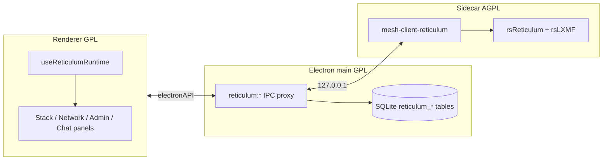
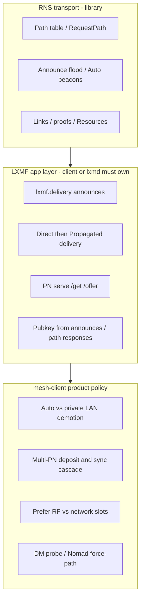

# Reticulum development

Developer and maintainer notes for the Reticulum integration: process architecture, the ownership split between RNS, LXMF and mesh-client policy, building the sidecar, and interop smoke tests. The user guide is [Reticulum in mesh-client](reticulum.md); the HTTP/WebSocket contract is [Reticulum sidecar IPC](reticulum-sidecar-ipc.md).

## Architecture



The renderer **must not** call the sidecar URL directly (sandbox). All HTTP/WS goes through main-process `reticulum:proxyGet` / `proxyPost` / `proxyPut` / `proxyDelete`. Paths must start with `/api/v1/`. Full route list: [reticulum-sidecar-ipc.md](reticulum-sidecar-ipc.md).

**Listen-first connect:** The sidecar binds HTTP first, then `attach_live` brings up RNS/LXMF (path table, BLE Peer, deferred PN messagestore). Electron health is `GET /api/v1/status` with `status: "ok"` — not `rns_ready` / `lxmf_ready`. `useReticulumRuntime` marks connection **configured** once start succeeds and identity is known, then hydrates peers/DB in the background and dispatches `RETICULUM_CONFIGURED_EVENT`. TCP hubs and RRC can proceed after live attach; Chat LXMF send/reaction fail closed with `requires live rns-stack sidecar` until the bridge is up. **Cancel** / stop does not wait on cargo or BLE. LoRa Meshtastic/MeshCore may call `ensureForBle()` so GATT is available without a Reticulum UI Start. Renderer LXMF/RRC proxy sends use a **15 s** IPC deadline (`RETICULUM_IPC_SEND_TIMEOUT_MS`).

### Ownership: RNS vs LXMF client vs mesh-client policy

Reticulum is not one blob that “does everything automatically.” Before adding sidecar or UI automation, classify the work:



| Layer                                                 | Owns                                                                                                                                                                                                            | mesh-client role                                                                                                                                                                                                                                                                                                                                                                            |
| ----------------------------------------------------- | --------------------------------------------------------------------------------------------------------------------------------------------------------------------------------------------------------------- | ------------------------------------------------------------------------------------------------------------------------------------------------------------------------------------------------------------------------------------------------------------------------------------------------------------------------------------------------------------------------------------------- |
| **RNS transport** (rsReticulum)                       | Path table, announce flooding, AutoInterface beacons, RMAP discovery announce signing, Links / proofs / Resources                                                                                               | Call transport APIs (`RequestPath`, path table reads, destination register). Do **not** reimplement pathfinding or beacon loops in the sidecar or UI. Library gaps belong in overlays under [`reticulum-sidecar/patches/`](../reticulum-sidecar/patches/README.md), not a second routing plane.                                                                                             |
| **LXMF client / PN** (rsLXMF + sidecar orchestration) | `lxmf.delivery` announce schedules, Direct→Propagated outbound driver, identity learning for LRPROOF, local PN serve (`/offer`/`/get`), client inbox retrieve                                                   | Intentional **lxmd / Ratspeak parity**. rsLXMF is a library, not a full daemon — the sidecar owns these loops (`lxmf_delivery.rs`, `lxmf_outbound.rs`, `propagation_*`, `pn_inbound.rs`). Without them, Chat and offline delivery do not work. Documented elsewhere as “Host PN fabric → Chat (lxmd-style glue)”: mesh-client is PN + end-client on rsLXMF, **not** a second `lxmd` binary. |
| **mesh-client product policy**                        | AutoInterface demotion toward private TCP/UDP, multi-slot path failover before PN fallback, prefer path medium, multi-PN deposit/sync cascade (Off/Auto/Manual), Chat DM auto-probe, Nomad `force_path_refresh` | **Not** required by bare RNS. Exists for multi-hub / Auto+LAN / UX. Treat as intentional product behavior; do not mistake it for transport.                                                                                                                                                                                                                                                 |

**Renderer rule:** UI mirrors sidecar events and configures policy (announce interval, Propagation mode, Path/Probe buttons, RMAP publish toggles, topology layout). It must not invent peer discovery, announce flooding, or a second pathfinder. Optimistic `announce.received` peer rows and Topology graphs are **views** over the RNS path table, not routing.

**What looks “automatic” but is correct to own in the sidecar**

- Periodic / startup **LXMF delivery** announces and Network **Announce now** (Ratspeak/lxmd parity; see Network tab).
- `LxmfOutboundDriver` Direct planning, path-request gating, retries, then Propagated cascade.
- PN hosting admission, peer `/offer` bookkeeping, silent `/get` catch-up, and renderer Auto/Manual **sync cascades** that call into those APIs.
- Registering announce/path-response handlers so Direct LRPROOF has peer public keys.

**What is product policy above RNS** (keep intentional; cite when changing)

- [`auto_path_policy.rs`](../reticulum-sidecar/src/stack/auto_path_policy.rs) — RNS correctly prefers 0-hop Auto; sidecar demotes unhealthy Auto toward a live **private** path for LXMF Direct (see [Path routing](reticulum.md#path-routing)).
- [`path_failover.rs`](../reticulum-sidecar/src/stack/path_failover.rs) + path-medium overlays — ranked slots / medium preference before giving up Direct.
- [`pn_cascade.rs`](../reticulum-sidecar/src/stack/pn_cascade.rs) + [`reticulumPropagationAutoApply.ts`](../src/renderer/lib/reticulum/reticulumPropagationAutoApply.ts) — multi-PN deposit and sync order.
- Chat DM auto-probe (`useReticulumDmPathProbe`) — reachability UX; RNS would still path on send.
- Nomad `force_path_refresh` — DropPath→RequestPath recovery for stale TCP hub paths.
- Nomad per-node **identify** (default **anonymous**) — Link sessions send `LINKIDENTIFY` only for nodes the user opted in; RNS itself has no such default. See [Nomad identify](reticulum.md#nomad-identify-to-this-site).

**Gate for new automation:** Is this RNS transport, LXMF client/PN (lxmd parity), or mesh-client policy? Prefer library/overlay for transport; prefer sidecar lxmd-shaped loops for LXMF; prefer explicit, documented policy modules for product overrides — never a parallel path table or announce flood in the renderer.

**Duplication vs ownership (send / path / propagation):** Extra sidecar (or renderer) code is not automatically “Ratspeak duplicated.” Classify before deleting or relocating:

| Area              | Upstream-owned                                                               | mesh-client-owned (keep)                                                                                                                                                                         | Suspicious duplication (do not add)                                      |
| ----------------- | ---------------------------------------------------------------------------- | ------------------------------------------------------------------------------------------------------------------------------------------------------------------------------------------------ | ------------------------------------------------------------------------ |
| **Send pipeline** | LXMF wire, Direct outbound driver, terminal `lxmf_outbound_status` Completes | Renderer outbox drain, optimistic pending→hash rekey, SQLite `delivery_status`, badge semantics (`sending` vs recipient **Delivered** vs PN deposit). `POST /lxmf/send` enqueue is not delivery. | A second outbound driver or treating HTTP send `ok` as recipient receipt |
| **Path policy**   | RNS path table, `RequestPath`, announce flood                                | `auto_path_policy.rs`, `path_failover.rs`, path-medium preference/pins — product policy on the RNS table                                                                                         | A parallel pathfinder or announce loop in sidecar or UI                  |
| **Propagation**   | PN `/offer`/`/get` wire (rsLXMF)                                             | Sidecar LXMF/PN loops (lxmd parity) plus `pn_cascade.rs` / Auto-discovered candidates / Off·Auto·Manual sync order (`reticulumPropagationAutoApply.ts`)                                          | A second messagestore or PN protocol implementation                      |

False **Delivered** on RF-only Chat is typically **renderer correlation** (outbox vs store row), not missing Ratspeak send logic. Correlate receipts to the attempt’s optimistic id/hash (`useChatOutbox.ts`); do not “fix” it by moving UI status into the sidecar.

---

## Building the sidecar (development)

`rns-stack` builds need the repo-local `.rsstack/` workspace checkouts `rsReticulum`, `rsLXMF`, `rsNomad`, `rsLXST`, and `lrgp-rs` (see `scripts/clone-ratspeak-stack.sh`). That script floats each to `origin/main` by default (optional bisect with `RS_RETICULUM_REF` / `RS_LXMF_REF` / `RS_NOMAD_REF` / `RS_LXST_REF` / `RS_LRGP_REF`) and applies mesh-client overlays for rsReticulum/rsLXMF (fails if a patch will not apply). Open upstream feature PRs such as [rsReticulum#26](https://github.com/ratspeak/rsReticulum/pull/26) and [rsLXMF#7](https://github.com/ratspeak/rsLXMF/pull/7) are carried as overlays (not SHA pins) — tracked by `pnpm run update`. Peer list / detail default avatars use [LXMFace](https://github.com/ratspeak/LXMFace) (`src/renderer/lib/reticulum/lxmface.ts`) when no custom Lucide icon is set.

End users of **GitHub Releases** or **Flatpak** do not need Rust. Developers and contributors do.

**One command** (from repo root; requires [Rust](https://rustup.rs/)):

```bash
pnpm run reticulum:sidecar:build
```

Cargo always needs the `.rsstack/` checkouts (`rsReticulum`, `rsLXMF`, `rsNomad`, `rsLXST`, `lrgp-rs`) as path dependencies — clone them with `./scripts/clone-ratspeak-stack.sh` (same as [reticulum-sidecar/README.md](../reticulum-sidecar/README.md)). With those trees present, the build script applies required patches and compiles with **`rns-stack,rns-ble,rns-rnode-tcp`** for the **real mesh-I/O** stack (live path table, BLE, RNode USB/Wi‑Fi, Nomad hosting, LXST voice, LRGP games). Building **without** `--features rns-stack` still uses those checkouts but links the **stub** stack (file-backed API for UI/tests — not for real mesh I/O).

**Electron dev:** **Start stack** auto-runs `cargo build` when the debug binary is missing, when `reticulum-sidecar/src/**/*.rs` or `Cargo.toml` is newer than the binary, or when a stub binary is present but the full `.rsstack/` workspace exists. First compile can take several minutes — pre-build with the command above.

**Run sidecar alone:**

```bash
pnpm run reticulum:sidecar:dev
curl -s http://127.0.0.1:19437/api/v1/status
```

CI matrix (stub + full stack): [`.github/workflows/reticulum-sidecar.yaml`](../.github/workflows/reticulum-sidecar.yaml). Flatpak release builds bundle the full-stack binary into `resources/reticulum-sidecar/`.

Patch overlays (packet tap, AutoInterface utun, discovery-announce-egress, rsLXMF policy-setters, …): [`reticulum-sidecar/patches/README.md`](../reticulum-sidecar/patches/README.md).

---

## Remote (rnsh / rncp) interop smoke

Wire protocols are stock Reticulum utilities — mesh-client is a client (and rncp receive listener), not a private dialect.

| Scenario       | Peer side                                                         | mesh-client side                                                                                                                                              |
| -------------- | ----------------------------------------------------------------- | ------------------------------------------------------------------------------------------------------------------------------------------------------------- |
| Shell          | `rnsh` / `rnsh-rs` listen; allow our identity (`-a` / allow-list) | Remote → Shell → paste `rnsh` destination hash → connect                                                                                                      |
| Send file      | `rncp -l -a <our_identity>` (or mesh-client inbound Ask)          | Remote → Transfer / Chat DM → peer `rncp.receive` hash (not LXMF)                                                                                             |
| Receive file   | `rncp file <our_receive_hash>`                                    | Remote → Settings → inbound Ask/allow-list; copy **My rncp receive destination**                                                                              |
| Fetch          | Peer `rncp -l -F -j <jail> -a <our_id>`                           | Remote → Transfer → Fetch remote path                                                                                                                         |
| Auth fail      | Peer allow-list omits us                                          | Error shows **not allowed** + copy our identity hash                                                                                                          |
| Request enable | Second mesh-client                                                | Chat/Transfer **Request enable** (`mesh-client:request-rncp-receive:v1`); peer replies with `mesh-client:rncp-receive-dest:v1:<hash>` so the sender autofills |

Transfers require a **high-speed** path (TCP/network); LoRa/BLE-only destinations are refused locally before a link opens. There is no byte-level resume — Retry restarts the full file.
