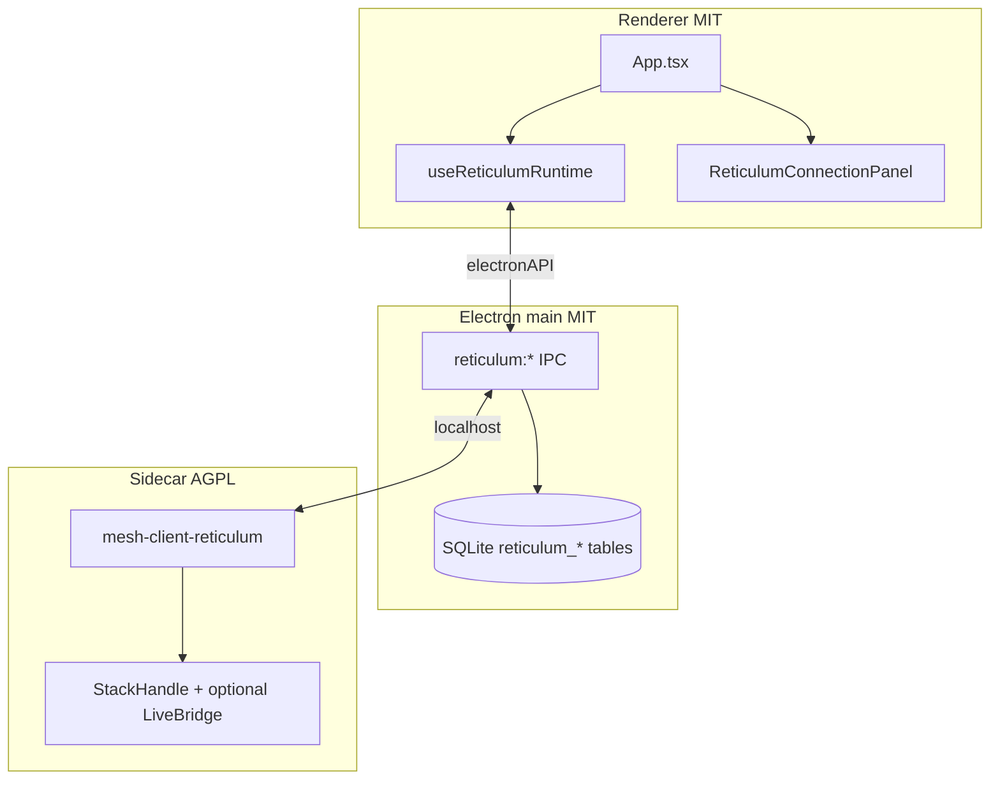

# Reticulum in mesh-client

Tracking: [#593](https://github.com/Colorado-Mesh/mesh-client/issues/593)

mesh-client ships Reticulum as a **third protocol tab** (amber chrome). The stack is an **AGPL Rust sidecar** (`mesh-client-reticulum`) spawned by Electron main; the MIT renderer talks to it through `electronAPI.reticulum` (HTTP/WS proxy). Chat history and contacts persist in the main-process SQLite database.

**Primary interop target:** [Ratspeak](https://github.com/ratspeak/Ratspeak) peers on rsReticulum/rsLXMF.

## Architecture



## User flow

1. **Reticulum → Connection:** click **Start stack** (or enable **Auto-start** for next visit).
2. **Identity:** create or import a 12-word mnemonic while the sidecar is running.
3. **Interfaces / peers:** add TCP, Auto, or RNode transports; manage propagation nodes.
4. **Chat:** DM-only LXMF text; use **Stop stack** to shut down the sidecar without quitting the app.

**Disconnect & quit** stops the sidecar (when running) and exits mesh-client, matching other protocol connection panels.

**Diagnostics tab is hidden** for Reticulum (Meshtastic/MeshCore routing engines do not apply). Network health, interfaces, peers, and propagation live in **Connection**.

## Building the sidecar

### Stub (CI / no siblings)

```bash
cd reticulum-sidecar && cargo build
```

Uses a file-backed local stack (full API surface for dev/UI).

### Full rsReticulum stack (dev)

Sibling layout (same as Ratspeak):

```
parent/
  rsReticulum/          # git clone https://github.com/ratspeak/rsReticulum
  rsLXMF/               # git clone https://github.com/ratspeak/rsLXMF
  mesh-client/
    reticulum-sidecar/
```

```bash
pnpm run reticulum:sidecar:build -- --features rns-stack
# or: cd reticulum-sidecar && cargo build --features rns-stack
```

Optional: `rns-serial`, `rns-ble` features for RNode and BLE peering.

## IPC contract

See [reticulum-sidecar-ipc.md](reticulum-sidecar-ipc.md). Renderer must not call localhost directly (sandbox).

## SQLite

- `reticulum_destinations` — contact rows (hash, display name, favorited).
- `reticulum_messages` — DM history keyed by `identity_id`.

Hydration: `hydrateIdentityStoresFromDb('reticulum', …)` on startup / DB refresh.

## Packaging

Per-arch binaries ship in `extraResources/reticulum-sidecar/` (see `electron-builder.yml`). CI builds stub sidecar on Linux, macOS arm64, Windows x64, and Windows ARM64.

## Licensing

- mesh-client app: **MIT**
- `mesh-client-reticulum` sidecar: **AGPL-3.0** (separate process)

See [license.md](license.md) and [credits.md](credits.md).

## Out of scope

Attachments/files, voice (LXST), games, Python meshchat fallback, embedding Ratspeak’s dashboard UI.

## Troubleshooting

See [troubleshooting.md](troubleshooting.md#reticulum-sidecar-wont-start-or-health-poll-times-out).
