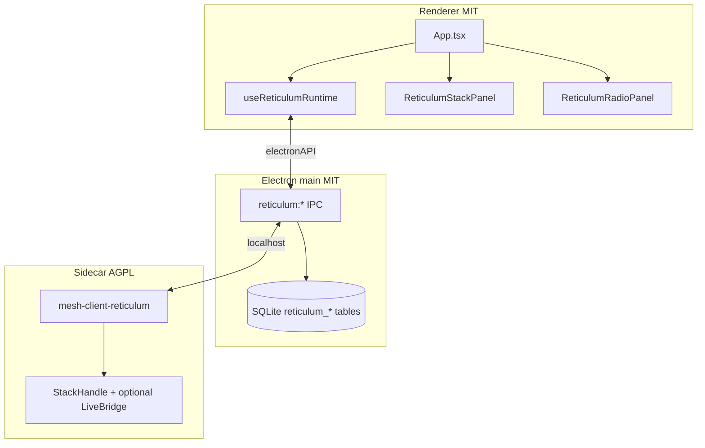

# Reticulum in mesh-client

Tracking: [#593](https://github.com/Colorado-Mesh/mesh-client/issues/593)

mesh-client ships Reticulum as a **third protocol tab** (amber chrome). The stack is an **AGPL Rust sidecar** (`mesh-client-reticulum`) spawned by Electron main; the MIT renderer talks to it through `electronAPI.reticulum` (HTTP/WS proxy). Chat history and contacts persist in the main-process SQLite database.

**Primary interop target:** [Ratspeak](https://github.com/ratspeak/Ratspeak) peers on rsReticulum/rsLXMF.

## Architecture



## User flow

1. **Reticulum → Connection** (`ReticulumStackPanel`): click **Start stack** (or enable **Auto-start** for next visit). **Stop stack** shuts down the sidecar without quitting the app; **Disconnect & quit** stops the sidecar (when running) and exits mesh-client.
2. **Reticulum → Radio** (`ReticulumRadioPanel`): create or import identity; add/edit/delete/enable interfaces; import or export rnsd-style config; adjust stack settings; manage peers and propagation; factory reset (danger zone).
3. **Chat:** DM-only LXMF text, reactions, and file attachments.

**Diagnostics tab** shows Reticulum-native interface/path/LXMF health (not Meshtastic Hop Goblins). **Graph tab** shows peer topology when hop data is available. Sidebar **Peers** tab ([`ReticulumPeerListPanel`](src/renderer/components/ReticulumPeerListPanel.tsx)) lists network peers and LXMF contacts in separate sub-tabs.

## Panels

| Tab (sidebar) | Component                | Purpose                                                                                                      |
| ------------- | ------------------------ | ------------------------------------------------------------------------------------------------------------ |
| Connection    | `ReticulumStackPanel`    | Stack start/stop, auto-start, disconnect & quit, connection status                                           |
| Nomad Network | `NomadNetworkPanel`      | Favourites / Announces list, search, favourite toggle (MeshChat-style)                                       |
| Peers         | `ReticulumPeerListPanel` | Network path-table peers and LXMF contacts (sub-tabs); path/probe; opens `ReticulumPeerDetailModal`          |
| Radio         | `ReticulumRadioPanel`    | Collapsible sections: flasher, identity, interfaces, peer summary, propagation, config import, factory reset |

## Interface management (Radio tab)

Interfaces are stored in the sidecar rnsd config under Electron `userData/reticulum/config/`. The Radio tab **Interfaces** section supports:

| Action | UI                                                            | Sidecar API               |
| ------ | ------------------------------------------------------------- | ------------------------- |
| Add    | Type selector (TCP / Auto / RNode) + form + **Add interface** | `POST /api/v1/interfaces` |

## RNode firmware flasher

The **Reticulum → Radio** tab lists **RNode Firmware Flasher** as the first collapsible section (visible before the stack starts). It uses the renderer **Web Serial API** to:

1. Flash nRF52 devices (DFU touch + zip manifest) or ESP32 devices (`esptool-js`).
2. **Provision** EEPROM on new hardware (device info, MD5 checksum, lock byte).
3. **Set firmware hash** after each flash (reads hash from device).
4. Optional advanced tools: Bluetooth, TNC mode, display read/rotation, EEPROM wipe.

**Serial port contention:** stop the Reticulum stack (or disable the active RNode interface) before flashing—the sidecar holds the serial port when an RNode interface is enabled. Disconnect Meshtastic or MeshCore USB serial on the same device.

Firmware `.zip` files are selected locally (in-app GitHub download is deferred).
| Edit | **Edit** on a row → inline form | `PUT /api/v1/interfaces/{id}` |
| Enable / disable | Per-row toggle | `POST …/enable` or `…/disable` |
| Delete | **Delete** + confirmation modal | `DELETE /api/v1/interfaces/{id}` |

**Edit fields by type:**

- **All:** display name
- **TCP:** host, port
- **RNode:** serial port (enumerated when available), LoRa preset, callsign
- **Auto:** name only (minimal discovery interface)

For bulk changes or migrating from Ratspeak/rsReticulum, use **Config import** (merge or replace) on the Radio tab, or paste from a file picked via the system config paths below.

## Building the sidecar

### Stub (CI / no siblings)

```bash
cd reticulum-sidecar && cargo build
```

Uses a file-backed local stack (full API surface for dev/UI).

### Full rsReticulum stack (dev)

Sibling layout (same as Ratspeak):

```
parent/
  rsReticulum/          # git clone https://github.com/ratspeak/rsReticulum
  rsLXMF/               # git clone https://github.com/ratspeak/rsLXMF
  mesh-client/
    reticulum-sidecar/
```

```bash
pnpm run reticulum:sidecar:build -- --features rns-stack
# or: cd reticulum-sidecar && cargo build --features rns-stack
```

Optional: `rns-serial`, `rns-ble` features for RNode and BLE peering.

CI builds both **stub** and **`rns-stack`** matrix jobs on linux x64, macOS arm64, and Windows x64/arm64 (see `.github/workflows/reticulum-sidecar.yaml`).

## IPC contract

See [reticulum-sidecar-ipc.md](reticulum-sidecar-ipc.md). Renderer must not call localhost directly (sandbox).

## SQLite

- `reticulum_destinations` — contact rows (hash, display name, favorited).
- `reticulum_messages` — LXMF chat history (`message_hash`, `reply_to_hash` for threads/reactions).

## Config import

Default system paths (main process reads; renderer imports via sidecar):

| Platform      | Paths                                                                          |
| ------------- | ------------------------------------------------------------------------------ |
| macOS / Linux | `~/.reticulum/config`, `~/.config/rsReticulum/config`, `~/.rsReticulum/config` |
| Windows       | `%APPDATA%\Reticulum\config`, `%APPDATA%\rsReticulum\config`                   |

The sidecar stores the active config under Electron `userData/reticulum/config/` (rnsd INI format).

## Out of scope / in progress

- **LXST voice** and **LRGP games**: API status endpoints exist; full rsLXST/lrgp-rs integration is tracked separately.
- **Hardware identity (YubiKey/PIV)**: not yet wired.
- **Meshtastic/MeshCore RF paths**: ConnectionDriver, MQTT hybrid, channel config, Rooms BBS, Hop Goblins diagnostics.
