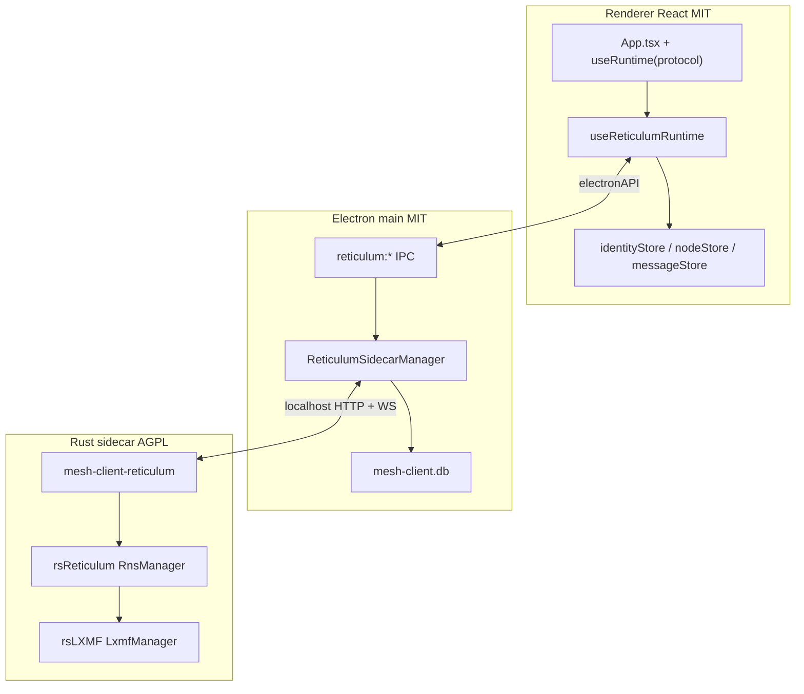

# Adding Reticulum to mesh-client

Tracking: [#593](https://github.com/Colorado-Mesh/mesh-client/issues/593)

Architecture review conclusion (see also `protocols.md` from [#543](https://github.com/Colorado-Mesh/mesh-client/issues/543)). Full Reticulum support uses a **Rust sidecar** (rsReticulum + rsLXMF — the [Ratspeak](https://github.com/ratspeak/Ratspeak) stack), Electron main-process IPC, and the existing React UI + SQLite.

**Primary reference:** [ratspeak/Ratspeak](https://github.com/ratspeak/Ratspeak) — actively developed; Ratspeak contributors overlap with mesh-client. Coordinate IPC/API with Ratspeak (`ratspeak-tauri` commands).

**Demoted reference:** [liamcottle/reticulum-meshchat](https://github.com/liamcottle/reticulum-meshchat) — sidecar spawn / health-poll / quit lifecycle only. **Do not** implement Python aiohttp API or cx_Freeze stack unless Rust sidecar fails acceptance on a platform.

---

## Strategic shift (June 2026)

| Topic            | Original draft                     | Current plan                                    |
| ---------------- | ---------------------------------- | ----------------------------------------------- |
| Primary stack    | Python RNS/LXMF sidecar (meshchat) | **Rust rsReticulum + rsLXMF** (Ratspeak)        |
| Reference client | meshchat first                     | **Ratspeak first**                              |
| Interop target   | Generic Python RNS mesh            | **Ratspeak peers on rsReticulum**               |
| meshchat         | Primary pattern                    | **Fallback only**                               |
| Windows          | x64 implied                        | **x64 + ARM64 (WoA)** — native sidecar per arch |

---

## Scope

| Phase                        | Status                 | PRs  | Issue         |
| ---------------------------- | ---------------------- | ---- | ------------- |
| A — Renderer prep            | **In progress** (~70%) | 1–5  | #543 (closed) |
| B — Rust sidecar + packaging | **Deferred**           | 6–8  | —             |
| C — Reticulum protocol       | **Deferred** (after B) | 9–11 | —             |

Phase A is protocol-agnostic. No `'reticulum'` in `REGISTERED_MESH_PROTOCOLS`, no Reticulum UI. When A is done, B+C are additive.

Issue #484 (legacy runtime file split) can run in parallel; not a hard gate for Phase A.

**Scaffold branch:** [`593/reticulum-sidecar-scaffold`](https://github.com/Colorado-Mesh/mesh-client/tree/593/reticulum-sidecar-scaffold) — headless `mesh-client-reticulum` stub routes; rsReticulum/rsLXMF wiring next.

---

## Architecture (target end state)



### Layer mapping (Ratspeak → mesh-client)

| Ratspeak crate            | mesh-client                                        |
| ------------------------- | -------------------------------------------------- |
| `ratspeak-core`           | `src/shared/` + `src/renderer/lib/reticulum/` DTOs |
| `ratspeak-db`             | `src/main/database.ts` reticulum tables + hydrator |
| `ratspeak-runtime`        | Rust sidecar (`reticulum-sidecar/`)                |
| `ratspeak-tauri` commands | `electronAPI.reticulum.*` + `ipcMain.handle`       |

---

## AGPL and licensing

- mesh-client remains **MIT**.
- rsReticulum / rsLXMF / Ratspeak are **AGPL-3.0**.
- **Do not** copy AGPL source into MIT TypeScript (renderer/main).
- **Do** ship AGPL Rust as a **separate sidecar process** spawned by Electron main.
- Document attribution + AGPL source-offer in `docs/licenses` / About credits.
- Update `check:licenses` for bundled sidecar artifact.
- Prefer upstreaming daemon/IPC improvements to rsReticulum or a shared headless crate.
- Avoid static linking AGPL into Electron main (napi-rs embed) unless relicensing path is explicit.

---

## Cross-platform packaging

mesh-client ships **Windows x64**, **Windows ARM64 (WoA)**, Linux, and macOS. The Rust sidecar **must match app CPU arch** — never bundle an x64 sidecar inside a WoA installer.

| Target            | Rust triple                   | CI / packaging                                                                              |
| ----------------- | ----------------------------- | ------------------------------------------------------------------------------------------- |
| Windows x64       | `x86_64-pc-windows-msvc`      | `windows-latest` job                                                                        |
| **Windows ARM64** | **`aarch64-pc-windows-msvc`** | **Dedicated WoA job** (`rustup target add aarch64-pc-windows-msvc`; MSVC ARM64 build tools) |
| Linux x64         | `x86_64-unknown-linux-gnu`    | `ubuntu-latest`                                                                             |
| macOS arm64       | `aarch64-apple-darwin`        | `macos-latest`                                                                              |
| macOS x64         | `x86_64-apple-darwin`         | If Intel Mac builds continue                                                                |

`ReticulumSidecarManager.resolveBinaryPath()` selects sidecar by `process.arch` (mirror per-arch Electron / `extraResources` layout).

**Platform caveats:**

- macOS: Gatekeeper on unsigned sidecar; network entitlements for TCP/Auto
- Windows: VC++ redist; BLE peering needs signed MSIX (post-MVP)
- Linux: serial udev for RNode; BLE peer needs BlueZ (post-MVP)
- Reticulum is **always-on multi-interface** — connect UX differs from Meshtastic/MeshCore

---

# Phase A — Renderer prep (IMPLEMENT NOW)

Goal: N-protocol-ready orchestration. Meshtastic/MeshCore unchanged. Zero `protocol ===` in `App.tsx`.

### Exit criteria

- [x] `ProtocolRuntime` interface exists
- [x] `ProtocolRuntimeProvider` + `useRuntime(protocol)`
- [x] `useAllProtocolPanelActions` (hooks-safe)
- [x] `usePowerRecovery` uses `Record<MeshProtocol, …>`
- [x] `offlineProtocolIdentities` uses `OFFLINE_IDENTITY_BY_PROTOCOL` map
- [x] `hydrateIdentityStoresFromDb` uses `IDENTITY_STORE_HYDRATORS` registry
- [x] `PROTOCOL_THEME` + `ProtocolSwitcher` data-driven
- [x] `OUTBOX_VALID_PROTOCOLS` / `MESH_PROTOCOL_SET` from `REGISTERED_MESH_PROTOCOLS`
- [ ] `App.tsx` — ~83 `protocol ===` → **0** (PR 5 destringify)
- [ ] Per-protocol tab map (not separate `meshtasticTabs` / `meshcoreTabs`)
- [ ] Remove `App.tsx` from `check-protocol-string-gates.mjs` allowlist

### Phase A — do not do

- Add `'reticulum'` to `REGISTERED_MESH_PROTOCOLS`
- Wire rsReticulum in renderer
- Add `reticulum:*` IPC handlers (Phase B)
- Widen Noble BLE or MQTT unions for Reticulum

_(PR 1–4 details unchanged from original plan — see git history of this file or #543 `protocols.md`.)_

---

# Phase B — Rust sidecar + packaging (DEFERRED)

Implement after Phase A merges. Delivers PRs 6–8.

Goal: Headless `mesh-client-reticulum` daemon mesh-client spawns in dev and ships per-arch in production.

### Exit criteria

- [ ] `reticulum-sidecar/` builds with rsReticulum + rsLXMF (sibling checkout or git pin)
- [ ] `GET /api/v1/status` returns ok
- [ ] Per-arch release binaries in CI (**Windows x64 + Windows ARM64** + Linux + macOS)
- [ ] `ReticulumSidecarManager` spawns sidecar, polls health, kills on quit
- [ ] `electronAPI.reticulum` in types/preload/main
- [ ] WoA smoke: extend `test-win-nsis-install.mjs --arch arm64` for sidecar start
- [ ] AGPL attribution in credits / `check:licenses`

---

## PR 6 — Rust sidecar scaffold

### Directory layout

```
reticulum-sidecar/
  Cargo.toml              # path deps: rsReticulum, rsLXMF
  src/
    main.rs               # headless daemon entry
    api/                  # localhost HTTP + WebSocket
    rns_stack.rs          # RnsManager (ratspeak-runtime patterns)
    lxmf_stack.rs         # LxmfManager
  README.md
```

### Sibling checkout (Ratspeak build layout)

```
ratspeak-src/
  rsReticulum/
  rsLXMF/
  mesh-client/reticulum-sidecar/
```

### Minimal daemon API (mirror `ratspeak-tauri`, not meshchat aiohttp)

| Method                          | Purpose                                                                                       |
| ------------------------------- | --------------------------------------------------------------------------------------------- |
| `GET /api/v1/status`            | Health + RNS/LXMF versions                                                                    |
| `GET/POST /api/v1/interfaces/*` | List, add, enable, disable                                                                    |
| `POST /api/v1/lxmf/send`        | Outbound LXMF                                                                                 |
| `GET /api/v1/contacts`          | Known destinations                                                                            |
| `WS /ws`                        | Push: `lxmf_message`, `announce.received`, `peers_updated`, `stats_update`, `interface.state` |

### Dev script

```json
"reticulum:sidecar:dev": "cd reticulum-sidecar && cargo run -- --headless --port 19437"
```

---

## PR 7 — `ReticulumSidecarManager` + IPC

File: `src/main/reticulum-sidecar-manager.ts`

| Method                | Behavior                                                                                |
| --------------------- | --------------------------------------------------------------------------------------- |
| `resolveBinaryPath()` | Per-arch `extraResources/reticulum-sidecar/mesh-client-reticulum` or dev `cargo` output |
| `start(opts?)`        | Pick free port, spawn, poll status until ok or timeout                                  |
| `stop()`              | SIGTERM → SIGKILL after grace                                                           |
| `getStatus()`         | running, port, pid, lastError                                                           |
| Event bridge          | WS → `webContents.send('reticulum:event', …)`                                           |

Storage:

- `userData/reticulum/config`
- `userData/reticulum/storage`

IPC namespace: `electronAPI.reticulum` in `src/shared/electron-api.types.ts`, preload, `ipcMain.handle`.

---

## PR 8 — Packaging + CI

### electron-builder `extraResources` (per arch)

Bundle the sidecar binary matching the installer arch (`win` vs `win-arm64`, etc.).

### CI matrix

| Job                    | Produces                      |
| ---------------------- | ----------------------------- |
| `ubuntu-latest`        | Linux x64 sidecar             |
| `macos-latest`         | macOS sidecar(s)              |
| `windows-latest` (x64) | `x86_64-pc-windows-msvc`      |
| **Windows ARM64**      | **`aarch64-pc-windows-msvc`** |

Each job uploads artifact; Electron release job downloads matching arch before `electron-builder`.

**Fallback:** Python meshchat sidecar documented as emergency-only if Rust fails acceptance — not parallel maintenance.

---

# Phase C — Reticulum protocol (DEFERRED)

Implement after Phase B. Delivers PRs 9–11.

Goal: Reticulum third protocol tab; LXMF chat; Ratspeak peer interop.

### Exit criteria

- [ ] `'reticulum'` in `REGISTERED_MESH_PROTOCOLS`
- [ ] Interfaces, connect, contacts from announces, LXMF send/receive
- [ ] SQLite persistence + offline identity hydration
- [ ] i18n, axe on amber protocol chrome
- [ ] No Meshtastic/MeshCore regression

---

## PR 9 — Registration, capabilities, Connection panel

- `ReticulumProtocol.ts` + `RETICULUM_CAPABILITIES` in `BaseRadioProvider.ts`
- `hasReticulumInterfaceConfig`, `hasReticulumNetworkPanel`, `nodeListTabUsesContactsLabel: true`
- `OFFLINE_IDENTITY_BY_PROTOCOL.reticulum = 'offline-reticulum'`
- `useReticulumRuntime()` stub in `runtimeMap`
- `PROTOCOL_THEME.reticulum` — amber pill (auto via `REGISTERED_MESH_PROTOCOLS.map`)
- Connection panel: interface editor (TCP, Auto, serial RNode)

---

## PR 10 — Runtime, session, SQLite, sidecar API

- Complete sidecar API + WS events
- `useReticulumRuntime.ts` — connect/disconnect, ingest → stores, `sendMessage`
- `reticulumSession.ts` + `useProtocolConnection` branch
- DB migrations: `reticulum_destinations`, `reticulum_messages` (or protocol column on shared tables)
- `IDENTITY_STORE_HYDRATORS.reticulum`
- `ChatMessage.sender_id`: `number | string` for hex hashes

---

## PR 11 — Chat, network, polish

- DM-only chat (no channel pills)
- Network/peers panel (Ratspeak `peers.js` patterns)
- Mnemonic identity wizard (Ratspeak `view-setup`)
- Tray unread includes reticulum identity
- vitest-axe on protocol switcher badges

---

## MVP vs later

| Feature                     | MVP      | Later                                     |
| --------------------------- | -------- | ----------------------------------------- |
| TCP + Auto interfaces       | yes      |                                           |
| Serial RNode                | yes      | preset catalog (`ratspeak-core/radio.rs`) |
| LXMF text DMs               | yes      | Ratspeak peer interop                     |
| Announces → contacts        | yes      |                                           |
| Peer/path visibility        | basic    | Ratspeak virtualized table                |
| Propagation nodes           | optional | yes                                       |
| `ratspeak.chat.v2` replies  | no       | yes                                       |
| Attachments / voice / games | no       | no                                        |

---

## What not to do (all phases)

1. Fork meshchat Vue UI or embed Ratspeak dashboard
2. Let sidecar own chat persistence (SQLite stays in mesh-client main)
3. Panel-action hook factories
4. Route Reticulum through Noble BLE or `mqtt-manager`
5. Copy AGPL Ratspeak source into MIT TS tree
6. Skip Phase A before adding `'reticulum'` literal

---

## Risks and open decisions

| Topic                  | Recommendation                                                      |
| ---------------------- | ------------------------------------------------------------------- |
| Stack                  | Rust Ratspeak stack primary; meshchat fallback only                 |
| AGPL                   | Sidecar process + credits + source-offer                            |
| IPC                    | Align with `ratspeak-tauri` commands; shared doc with Ratspeak devs |
| rsReticulum pin        | Git rev / submodule synced with Ratspeak releases                   |
| Windows WoA            | Native `aarch64-pc-windows-msvc` sidecar required                   |
| macOS Intel            | Build x64 in CI if still shipping Intel Mac                         |
| Always-on vs on-demand | On-demand when Reticulum tab active                                 |

---

## Relationship to `protocols.md`

[#543](https://github.com/Colorado-Mesh/mesh-client/issues/543) prep work validated N-protocol orchestration. This document supersedes the June 2026 Python-sidecar draft attached in the first #593 comment.
