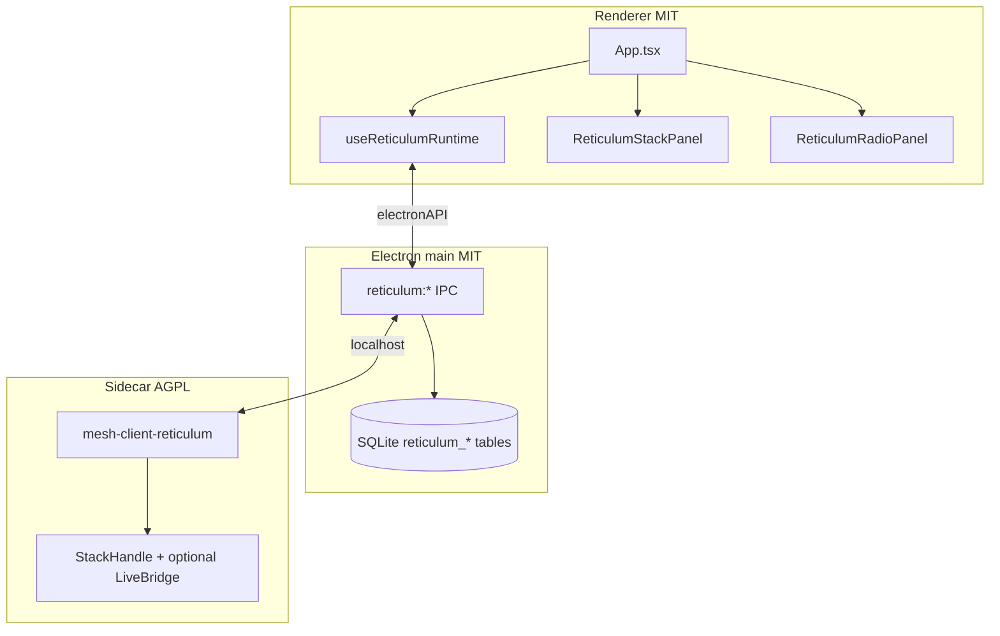

# Reticulum in mesh-client

Tracking: [#593](https://github.com/Colorado-Mesh/mesh-client/issues/593)

mesh-client ships Reticulum as a **third protocol tab** (amber chrome). The stack is an **AGPL Rust sidecar** (`mesh-client-reticulum`) spawned by Electron main; the MIT renderer talks to it through `electronAPI.reticulum` (HTTP/WS proxy). Chat history and contacts persist in the main-process SQLite database.

**Primary interop target:** [Ratspeak](https://github.com/ratspeak/Ratspeak) peers on rsReticulum/rsLXMF.

## Architecture



## User flow

1. **Reticulum → Connection:** click **Start stack** (or enable **Auto-start** for next visit).
2. **Reticulum → Radio:** create or import identity; configure interfaces; import rnsd-style config; manage peers and propagation.
3. **Chat:** DM-only LXMF text, reactions, and file attachments; use **Stop stack** on Connection to shut down the sidecar without quitting the app.

**Disconnect & quit** stops the sidecar (when running) and exits mesh-client, matching other protocol connection panels.

**Diagnostics tab** shows Reticulum-native interface/path/LXMF health (not Meshtastic Hop Goblins). **Graph tab** shows peer topology when hop data is available.

## Building the sidecar

### Stub (CI / no siblings)

```bash
cd reticulum-sidecar && cargo build
```

Uses a file-backed local stack (full API surface for dev/UI).

### Full rsReticulum stack (dev)

Sibling layout (same as Ratspeak):

```
parent/
  rsReticulum/          # git clone https://github.com/ratspeak/rsReticulum
  rsLXMF/               # git clone https://github.com/ratspeak/rsLXMF
  mesh-client/
    reticulum-sidecar/
```

```bash
pnpm run reticulum:sidecar:build -- --features rns-stack
# or: cd reticulum-sidecar && cargo build --features rns-stack
```

Optional: `rns-serial`, `rns-ble` features for RNode and BLE peering.

CI builds both **stub** and **`rns-stack`** matrix jobs on linux x64, macOS arm64, and Windows x64/arm64 (see `.github/workflows/reticulum-sidecar.yaml`).

## IPC contract

See [reticulum-sidecar-ipc.md](reticulum-sidecar-ipc.md). Renderer must not call localhost directly (sandbox).

## SQLite

- `reticulum_destinations` — contact rows (hash, display name, favorited).
- `reticulum_messages` — LXMF chat history (`message_hash`, `reply_to_hash` for threads/reactions).

## Config import

Default system paths (main process reads; renderer imports via sidecar):

| Platform      | Paths                                                                          |
| ------------- | ------------------------------------------------------------------------------ |
| macOS / Linux | `~/.reticulum/config`, `~/.config/rsReticulum/config`, `~/.rsReticulum/config` |
| Windows       | `%APPDATA%\Reticulum\config`, `%APPDATA%\rsReticulum\config`                   |

The sidecar stores the active config under Electron `userData/reticulum/config/` (rnsd INI format).

## Out of scope / in progress

- **LXST voice** and **LRGP games**: API status endpoints exist; full rsLXST/lrgp-rs integration is tracked separately.
- **Hardware identity (YubiKey/PIV)**: not yet wired.
- **Meshtastic/MeshCore RF paths**: ConnectionDriver, MQTT hybrid, channel config, Rooms BBS, Hop Goblins diagnostics.
