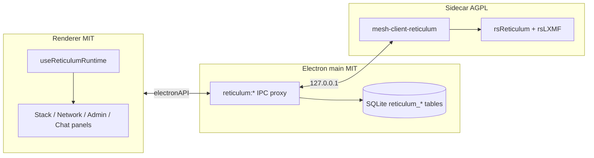

# Reticulum in mesh-client

Reticulum is a **shipped third protocol** in mesh-client (amber header pill). It runs alongside Meshtastic and MeshCore in the same Electron app: switch tabs without stopping the other stacks.

The MIT TypeScript UI talks to an **AGPL Rust sidecar** (`mesh-client-reticulum`) over localhost HTTP/WebSocket via `electronAPI.reticulum`. LXMF chat history and contacts persist in the main-process SQLite database. **Flatpak** releases always bundle the sidecar; **macOS / Linux / Windows** installers include it when `resources/reticulum-sidecar/` is populated at packaging time (see [Release Process — Reticulum sidecar](release-process.md#reticulum-sidecar-in-installers)). See [License](license.md) and [Credits — bundled binaries](credits.md#bundled-binaries).

**Primary interop:** [Ratspeak](https://github.com/ratspeak/Ratspeak) peers on [rsReticulum](https://github.com/ratspeak/rsReticulum) / [rsLXMF](https://github.com/ratspeak/rsLXMF).

Related docs: [README — Reticulum Features](../README.md#reticulum-features), [Sidecar IPC contract](reticulum-sidecar-ipc.md), [Development — Reticulum sidecar](development-environment.md#reticulum-sidecar-optional), [Troubleshooting — Reticulum](troubleshooting.md#reticulum).

---

## Quick start

1. Select the **Reticulum** pill (amber) in the header.
2. **Connection** → **Start stack** (optional **Auto-start** for next launch).
3. **Network** → generate or import your LXMF identity (stack must be running).
4. **Connection → Interfaces** → add and enable transports (TCP hub, I2P, Auto, or RNode over USB / BLE / Wi‑Fi). Use **Add default network hubs** to sync official bootstrap presets (testnet, Ratspeak, and RMAP World — adds missing rows disabled, repairs mismatched endpoints, skips correct ones) after identity is configured.
5. **Chat** → LXMF direct messages. **Peers** and **Topology** for path-table visibility. **Nomad Network** → browse announced nodes (Micron pages, back/forward, session cache).

After changing interfaces on a live network, **restart the stack** so RNS picks up transport changes.

---

## What is included

| Area            | Shipped behavior                                                                                                                                                                                                                                     |
| --------------- | ---------------------------------------------------------------------------------------------------------------------------------------------------------------------------------------------------------------------------------------------------- |
| Stack lifecycle | Start / stop / auto-start; disconnect & quit                                                                                                                                                                                                         |
| Interfaces      | TCP client, I2P (`peers`), Auto discovery, RNode (USB serial, `ble://…`, Wi‑Fi `tcp://host:7633`); default hub presets (testnet + Ratspeak + RMAP World, added disabled; button syncs/repairs by endpoint)                                           |
| Identity        | Generate / import mnemonic; display name; encrypted export; **identity vault** passcode on Network tab                                                                                                                                               |
| LXMF chat       | DM-only text, reactions, file attachments, voice clips (~60 s)                                                                                                                                                                                       |
| Delivery        | Direct when destination is in path table; propagated (PN) via preferred propagation node when offline                                                                                                                                                |
| Peers           | RNS path table + LXMF contacts (Peers tab sub-tabs); probe and peer detail modal                                                                                                                                                                     |
| Topology        | Best-effort graph from path-table next hops (not a full multi-hop trace)                                                                                                                                                                             |
| Map             | Local RMAP v4 discovery map (heard opt-in interfaces with GPS); link to rmap.world for global view                                                                                                                                                   |
| Nomad Network   | Favourites / announces list (collapsible sidebar, default Favourites sub-tab); lazy-mount after first visit; Micron (.mu) browser with in-page navigation, back/forward, session page cache, `/file/` downloads, source toggle, and lxmf:// DM links |
| Propagation     | Preferred node, per-node **Sync messages**, optional **local propagation inbox**, configurable **auto-sync interval**                                                                                                                                |
| Diagnostics     | Reticulum-native interface / path / LXMF health and config audit (`reticulum/*` rows only on this tab; LoRa Hop Goblins and foreign-LoRa tables are Meshtastic/MeshCore-scoped)                                                                      |
| Admin           | RNode firmware flasher (Web Serial), stack factory reset                                                                                                                                                                                             |
| Sniffer / Stats | Reticulum packet log tab (`rawPacketLog.reticulum.*`)                                                                                                                                                                                                |
| Coexistence     | BLE on a **different** MAC from Meshtastic/MeshCore; scan mutex; **Noble BLE yield** when an enabled BLE RNode is in config (sidecar suspends Noble on macOS/Windows so btleplug can pair)                                                           |

**Not in Reticulum mode:** Meshtastic/MeshCore-style RF channel chat, MQTT broker card, Meshtastic/MeshCore LoRa node position map, Rooms BBS, TAK, Meshtastic PKI Security tab, Hop Goblins routing diagnostics.

---

## Sidebar tabs

| Tab             | Role                                                                                                                                        |
| --------------- | ------------------------------------------------------------------------------------------------------------------------------------------- |
| Connection      | Stack start/stop, auto-start, interfaces CRUD, interface health, **Pick device** (serial / BLE)                                             |
| Chat            | LXMF DMs (only chat mode for Reticulum)                                                                                                     |
| Nomad Network   | Favourites, announces, and Micron page browser (navigation, cache, file downloads)                                                          |
| Peers           | Path-table peers and LXMF contacts (sidebar label **Peers**; Meshtastic/MeshCore use **Nodes**)                                             |
| Network         | Identity, stack settings, announces, propagation, config import/export, identity vault (sidebar label **Network**; LoRa tabs use **Radio**) |
| Admin           | RNode firmware flasher; factory reset (danger zone)                                                                                         |
| Diagnostics     | Reticulum runtime rows + interface config audit/repair; LoRa routing/RF and foreign-LoRa findings hidden                                    |
| Topology        | Path-table graph (BFS layout; `via_hash` next-hop edges)                                                                                    |
| Map             | RMAP v4 discovery map (local heard interfaces + path-table reachability overlay)                                                            |
| Stats / Sniffer | Packet log views (`rawPacketLog.reticulum.*`)                                                                                               |
| App             | Shared app settings, DB tools, appearance (includes **Log panel** toggle)                                                                   |

Hidden tabs (Meshtastic/MeshCore only): Modules/Repeaters, Rooms, Telemetry, Security, TAK, RF, Graph.

The **Log panel** (right rail, toggled from **App → Log panel**) is shared across protocols; on Reticulum it shows sidecar and local-interface lines tagged for filtering.

### Default hub presets

**Connection → Interfaces** offers **Add default network hubs** to sync official bootstrap entries from [`reticulumDefaultHubPresets.ts`](../src/renderer/lib/reticulum/reticulumDefaultHubPresets.ts). New presets are added **disabled** so you can enable them after review. On repeat clicks the button **skips** rows that already match the preset, **repairs** rows that match the same TCP host+port or I2P peer but have wrong name/type/host formatting (does not change `enabled`), and **adds** any missing presets:

| Preset                        | Type | Host                                                           |
| ----------------------------- | ---- | -------------------------------------------------------------- |
| RNS Testnet Dublin            | TCP  | `dublin.connect.reticulum.network:4965`                        |
| RNS Testnet BetweenTheBorders | TCP  | `reticulum.betweentheborders.com:4242`                         |
| RNS_Transport_US-East         | TCP  | `45.77.109.86:4965`                                            |
| RNS Testnet I2P Hub A         | I2P  | `g3br23bvx3lq5uddcsjii74xgmn6y5q325ovrkq2zw2wbzbqgbuq.b32.i2p` |
| Ratspeak                      | TCP  | `rns.ratspeak.org:4242`                                        |
| RMAP World                    | TCP  | `rmap.world:4242`                                              |

Configure a Reticulum identity on the **Network** tab before adding interfaces; the panel disables interface actions until identity is ready.

### RMAP v4 discovery map

The **Map** tab shows **local** RMAP v4 discovery data — interfaces your stack has heard on aspect `rnstransport.discovery.interface`. This is distinct from Meshtastic/MeshCore node position maps:

| View                      | Source                                                                                                                  |
| ------------------------- | ----------------------------------------------------------------------------------------------------------------------- |
| **Map tab (local)**       | rsReticulum `DiscoveryStore` via `GET /api/v1/rmap/discovered`; refreshed on a timer and via WebSocket `rmap.discovery` |
| **Global map (external)** | [rmap.world](https://rmap.world/) — link in Map tab and Network → RMAP controls                                         |

**Publish (appear on maps):** Network → **RMAP v4 discovery** or per-interface RMAP toggles on Connection. Requires App → GPS coordinates for map markers. LoRa-only stacks need an enabled TCP hub (for example `rmap.world:4242`) so discovery announces reach the wider network — see config audit `rmap_no_tcp_hub`.

**Consume (Map tab):** Sidecar bootstrap migrations in rnsd config: `discover_interfaces = Yes` so the stack listens for discovery announces; when `announce_interval_sec` is absent, writes **3600** (explicit **0** is preserved). Markers show GPS when coordinates were included in the announce; interfaces without coords appear in the sidebar list only. **Reachable** badges join discovery rows with the RNS path table (Peers tab) by matching `transport_id` against peer `destination_hash` or `via_hash`.

**UI:** Leaflet map with 280px sidebar list; filter pills (All, LoRa, Backbone, I2P, TCP, Other); basemap switcher and Locate Me (App GPS); manual Refresh; marker click opens peer detail when the node is in the path table. List row click flies to coordinates at zoom 14.

**Refresh model:** Map tab polls `GET /api/v1/rmap/discovered` every **30s** while mounted; sidecar also pushes WebSocket `rmap.discovery` every **10s** when the discovery fingerprint changes (runtime updates store even when Map tab is hidden).

**Publish settings (Network → RMAP v4 discovery):** announce interval **60–1440 min** (default **360**); optional height (meters) and `reachable_on` (max 256 chars). LoRa/BLE publish auto-enables `enable_transport` and the **`rmap.world:4242`** hub. Stack restart confirm after enabling publish.

**Performance / memory:** Renderer mirrors discovery rows in `reticulumDiscoveryMapStore` (in-memory only; capped at **2,000** newest rows with client-side 7-day `last_heard` eviction). Peer store capped at **10,000** entries on refresh. Leaflet uses `preferCanvas`; tile layer `keepBuffer={1}`. No marker clustering — typical scale is bounded by sidecar TTL. Stores clear on disconnect and unexpected sidecar stop.

**Config audit kinds:** `rmap_missing_coordinates`, `rmap_no_tcp_hub`, `rmap_transport_disabled`, `rmap_i2p_not_connectable`.

**Implementation:** `ReticulumMapPanel.tsx`, `reticulumDiscoveryMapStore.ts`, `reticulumDiscoveryMapLayout.ts`, `reticulumRmapDiscovery.ts`, `useReticulumRuntime.ts` (WS `rmap.discovery`).

**Related panels:** **Topology** = logical hops (no geography); **Peers** = path table; **Map** = geographic discovery + reachability.

---

## Architecture


```mermaid
flowchart LR
  subgraph ui [Renderer MIT]
    RT[useReticulumRuntime]
    Panels[Stack / Network / Admin / Chat panels]
    RT --> Panels
  end
  subgraph main [Electron main MIT]
    IPC[reticulum:* IPC proxy]
    DB[(SQLite reticulum_* tables)]
    IPC --> DB
  end
  subgraph sidecar [Sidecar AGPL]
    Bin[mesh-client-reticulum]
    RNS[rsReticulum + rsLXMF]
    Bin --> RNS
  end
  ui <-->|electronAPI| IPC
  IPC <-->|127.0.0.1| Bin
```

The renderer **must not** call the sidecar URL directly (sandbox). All HTTP/WS goes through main-process `reticulum:proxyGet` / `proxyPost` / `proxyPut` / `proxyDelete`. Paths must start with `/api/v1/`. Full route list: [reticulum-sidecar-ipc.md](reticulum-sidecar-ipc.md).

---

## Interface management (Connection tab)

Config lives under `userData/reticulum/config/` (rnsd INI). The Connection tab supports add, edit, enable/disable, and delete:

| Action            | Sidecar API                                                                                                                                      |
| ----------------- | ------------------------------------------------------------------------------------------------------------------------------------------------ |
| Add               | `POST /api/v1/interfaces`                                                                                                                        |
| Edit              | `PUT /api/v1/interfaces/{id}`                                                                                                                    |
| Enable / disable  | `POST …/enable` or `…/disable`                                                                                                                   |
| Delete            | `DELETE /api/v1/interfaces/{id}`                                                                                                                 |
| Set primary RNode | `POST /api/v1/interfaces/primary-local-rnode` `{ id }` when **two or more** enabled local RNode paths are active (USB serial, BLE, or local TCP) |

**Fields by type**

- **All:** display name
- **TCP client:** host, port (mesh hub — default port **4242**); IPv6 literals use brackets: `[2001:db8::1]:4242`
- **I2P:** comma-separated peer hostnames (`.b32.i2p` addresses, e.g. `{52-base32-chars}.b32.i2p`); max **512** characters total; validated in UI and sidecar before write
- **RNode:** USB serial, **Bluetooth** (`ble://…`), or **Wi‑Fi** (`tcp://host[:7633]`, default **7633**), LoRa preset, callsign
- **BLE Peer mesh:** optional seed peer addresses
- **Auto:** name only (link-local discovery)

**Pick device** opens a modal for serial or BLE selection:

- **Serial:** lists `GET /api/v1/serial/ports` with refresh; manual path entry supported
- **BLE RNode / BLE Peer:** runs `GET /api/v1/ble/scan` with `mode=rnode` or `mode=peer` (8 s timeout); rescans after Noble/btleplug settle when Meshtastic/MeshCore also use BLE
- Sidecar exposes `GET /api/v1/ble/availability` for permission / adapter state

When multiple enabled local RNode interfaces are connected, the interface list shows which row is **primary**; use **Set as primary** to reorder via `primary-local-rnode` (see [Sidecar IPC](reticulum-sidecar-ipc.md)).

**RNode Wi‑Fi:** stays type **RNode** with `port = tcp://host:7633`. Do **not** use the TCP Client type for RNode Wi‑Fi. Provision Wi‑Fi over USB from **Admin → Wi‑Fi** (or RNode AP bootstrap) before adding the interface. Packaged sidecars include `rns-rnode-tcp`. See [RNode over Wi-Fi](#rnode-over-wi-fi) below.

**Bluetooth coexistence:** Meshtastic, MeshCore, and Reticulum may each use Bluetooth on **different devices** at once. Same MAC is rejected. Only **active scans** are serialized; connected GATT links are not torn down for another protocol’s scan. On Linux, LoRa stacks use Web Bluetooth in the renderer; Reticulum uses the sidecar `btleplug` stack.

**Noble BLE yield (macOS/Windows):** When the Reticulum config includes an **enabled BLE RNode** (`ble://…`), sidecar start calls `bleCoexistence:suspendNobleForReticulumBleConnect` — Noble disconnects GATT sessions and holds the scan mutex until the RNode connects or a grace window expires. mesh-client then dispatches `mesh-client:nobleBleYieldReleased` so Meshtastic/MeshCore can reconnect. An always-mounted runtime watcher releases the lock even when the Reticulum Connection tab is not visible.

**Bulk migration:** **Network → Config import** (merge or replace), or import from standard system paths (see [Config import paths](#config-import-paths-system)).

### Config audit and repair

**Diagnostics → Reticulum interface config** (and inline Connection hints) compare rnsd config to the live interface list:

- Ghost TCP rows (enabled in config but not loaded by RNS)
- Unreachable TCP hubs
- RNode RF preset mismatches

**Repair config** normalizes TCP blocks and legacy preset ids; **Apply preset** writes coordinated defaults. Preset data: [`src/shared/reticulumRnodeRfProfiles.json`](../src/shared/reticulumRnodeRfProfiles.json) (coordinated regional, global fallback, legacy aliases such as `rnode_us915` → `rnode_us`).

---

## Network tab

- **Identity:** generate BIP-39 recovery phrase, import **private key** (paste or file picker via `reticulum:showIdentityImportDialog`), import **backup JSON**, export with passphrase, display name; **replace identity** confirm when keys already exist (`replace: true` on generate/import)
- **Note:** `GET /api/v1/identities` and `POST /api/v1/identities/switch` remain sidecar APIs; mesh-client UI uses a single unified identity (no in-app identity switcher)
- **Identity vault:** optional passcode (minimum 8 characters) to encrypt secrets in the main process; unlock is rate-limited
- **Stack settings:** `enable_transport`, `share_instance`, `loglevel` via `PUT /api/v1/stack/settings` (UI merge-reads so `announce_interval_sec` is not cleared accidentally)
- **Announces:** interval (`announce_interval_sec`, 0–86400; default **3600** s / 1 h when unset; `0` = startup-only) persisted in rnsd config. The live sidecar sends an **LXMF delivery** announce shortly after stack start and on that interval (Ratspeak/lxmd parity). **Announce now** (`POST /api/v1/announces`) forces an immediate delivery announce. **Clear announces** (`DELETE /api/v1/announces`) clears the stub peer cache; the live path table may refill on the next peer refresh. Per-interface `announce_interval_min` (RMAP/discoverable interfaces) is separate.
- **Inbound LXMF:** the sidecar registers `lxmf.delivery` with the transport (`RegisterDestination` + `LinkManager`) and feeds decrypted link/resource payloads into the delivery callback (WS `lxmf_message`). Without this registration, peer DMs never appear in Chat even when paths exist.
- **Propagation:** preferred node for offline DMs, per-node **Sync messages**, add remote propagation nodes by 32-character hash, optional **local propagation inbox**, **auto-sync interval** (`auto_sync_interval_sec`; `0` disables periodic sync)

---

## Chat (LXMF)

- **DM-only** — no RF channel pills
- Text, emoji reactions, file attachments (paperclip), voice clips (mic, max ~60 s)
- Outbound **Sending** until sidecar emits `lxmf_outbound_status` (`delivered` / `failed`)
- Inbound attachments cached under `userData/reticulum/attachments/`; main process jails paths for save/show-in-folder

### Delivery modes

| Path table          | Propagation node | Result                                                         |
| ------------------- | ---------------- | -------------------------------------------------------------- |
| Destination present | —                | **Direct** (link delivery); RF/TCP/NET badge → **Delivered**   |
| Destination absent  | Preferred PN set | **Propagated**; **PN** badge until sidecar confirms            |
| Destination absent  | None             | Error `no_propagation_node`; set preferred node on Network tab |

Reticulum is async — offline peers need a propagation node, not a TCP-style immediate refusal.

---

## Peers and topology

- **`GET /api/v1/peers`:** live RNS path table when the sidecar is built with the full stack; cached on fetch failure
- **Your node** does not appear as a peer row; identity hash is under **Network → Identity**; topology uses a synthetic **You** center node
- **`interface` column:** path learned via that interface, not “devices on this serial port”
- **Display names / aliases:** sidecar peers may ship without labels; mesh-client enriches from (in order) sidecar `display_name`, **LXMF / Nomad announce** `app_data` (msgpack, JSON `server_name`, or UTF-8 — parsed in the sidecar; RMAP/geo JSON blobs are rejected), SQLite `reticulum_destinations.display_name`, and Nomad Network node list during `refreshReticulumPeersFromSidecar`. Renderer display (`sanitizeReticulumDisplayName`) mirrors sidecar rules for already-stored bad values. Inbound LXMF ingest (`reticulumIngest.ts`) treats a `sender_name` equal to the destination hash prefix as a **placeholder**, not a real alias — contact upserts omit it. SQLite upsert (`db:upsertReticulumDestination`) **refuses to overwrite** an existing name with a hash-prefix alias (case-insensitive guard on the first 12 hex chars).
- **Topology:** one next hop per destination (`via_hash`); sidecar infers `self → relay` when needed; BFS layout with hop fallback

---

## RNode over Wi-Fi

| Step      | Action                                                                               |
| --------- | ------------------------------------------------------------------------------------ |
| Provision | USB → **Admin → Wi‑Fi**, or join RNode AP → `http://10.0.0.1`, or `rnodeconf`        |
| Interface | **Connection → Interfaces → RNode → Wi‑Fi** → host/IP, port **7633**, LoRa preset    |
| Hardware  | ESP32-S3 Wi‑Fi boards; stock firmware disables plain ESP32 Wi‑Fi                     |
| Pitfall   | Wi‑Fi off until provisioned; find station IP on OLED, DHCP, or Admin **Read config** |
| IPv6      | Use bracketed literals: `tcp://[2001:db8::1]:7633`                                   |

Stop the stack (or disable the RNode interface) before flashing the same device over USB — the sidecar holds the serial port.

---

## Admin (RNode flasher)

Collapsible **RNode Firmware Flasher** (available even before the stack starts). Uses Web Serial in the renderer:

1. Flash nRF52 (DFU + zip) or ESP32 (`esptool-js`)
2. Provision EEPROM (device info, checksum, lock)
3. Set firmware hash after flash
4. Optional: Bluetooth, Wi‑Fi provisioning, TNC, display, EEPROM wipe

Firmware `.zip` files are selected locally (no in-app GitHub download). Disconnect Meshtastic/MeshCore USB on the same port before flashing.

**Factory reset** in the danger zone clears stack state (destructive).

---

## Data storage

### SQLite (main process)

| Table                    | Contents                                                             |
| ------------------------ | -------------------------------------------------------------------- |
| `reticulum_destinations` | Contact rows (hash, display name, favorited)                         |
| `reticulum_messages`     | LXMF history (`message_hash`, `reply_to_hash` for threads/reactions) |

### Sidecar `userData`

| Path                                       | Contents                                                                                                           |
| ------------------------------------------ | ------------------------------------------------------------------------------------------------------------------ |
| `reticulum/config/`                        | Active rnsd INI                                                                                                    |
| `reticulum/attachments/`                   | Inbound LXMF attachment files                                                                                      |
| `reticulum/storage/mesh_client_stack.json` | Stub/dev file-backed stack state when not using live RNS — **treat as sensitive** (may hold mnemonic in stub mode) |

### Config import paths (system)

| Platform      | Paths                                                                          |
| ------------- | ------------------------------------------------------------------------------ |
| macOS / Linux | `~/.reticulum/config`, `~/.config/rsReticulum/config`, `~/.rsReticulum/config` |
| Windows       | `%APPDATA%\Reticulum\config`, `%APPDATA%\rsReticulum\config`                   |

---

## Building the sidecar (development)

End users of **GitHub Releases** or **Flatpak** do not need Rust. Developers and contributors do.

**One command** (from repo root; requires [Rust](https://rustup.rs/)):

```bash
pnpm run reticulum:sidecar:build
```

When sibling checkouts `../rsReticulum` and `../rsLXMF` exist, the build script applies required patches and compiles with **`rns-stack,rns-ble,rns-rnode-tcp`** (live path table, BLE, RNode USB/Wi‑Fi). Without siblings, Cargo builds the **stub** stack (file-backed API for UI/tests — not for real mesh I/O).

**Electron dev:** **Start stack** auto-runs `cargo build` when the debug binary is missing, when `reticulum-sidecar/src/**/*.rs` or `Cargo.toml` is newer than the binary, or when a stub binary is present but full-stack siblings exist. First compile can take several minutes — pre-build with the command above.

**Run sidecar alone:**

```bash
pnpm run reticulum:sidecar:dev
curl -s http://127.0.0.1:19437/api/v1/status
```

CI matrix (stub + full stack): [`.github/workflows/reticulum-sidecar.yaml`](../.github/workflows/reticulum-sidecar.yaml). Flatpak release builds bundle the full-stack binary into `resources/reticulum-sidecar/`.

Patch overlays (packet tap, AutoInterface utun fix): [`reticulum-sidecar/patches/README.md`](../reticulum-sidecar/patches/README.md).

---

## Limitations

- **No LoRa companion parity** — no `ConnectionDriver`, MQTT hybrid, channel chat, Rooms, or Meshtastic-style diagnostics
- **Interface changes need restart** — CRUD writes config on disk; restart stack after add/edit/delete on live `rns-stack` builds
- **Clear announces** — path table may refill from the live network on the next refresh
- **Topology** — next-hop only; not a full end-to-end trace
- **AGPL sidecar** — separate process and license from the MIT Electron shell
- **LXST voice calls** and **LRGP games** — not integrated (status endpoints may exist in sidecar; no UI)
- **Hardware identity (YubiKey/PIV)** — not wired
- **In-app firmware download** — local `.zip` pick only

---

## Troubleshooting

| Symptom                                    | Doc                                                                                                                                                                |
| ------------------------------------------ | ------------------------------------------------------------------------------------------------------------------------------------------------------------------ |
| Sidecar won't start / health timeout       | [troubleshooting.md#reticulum-sidecar-wont-start-or-health-poll-times-out](troubleshooting.md#reticulum-sidecar-wont-start-or-health-poll-times-out)               |
| `register_packet_tap` / cargo build failed | [troubleshooting.md#reticulum-sidecar-cargo-build-fails](troubleshooting.md#reticulum-sidecar-cargo-build-fails-register_packet_tap--reticulum_cargo_build_failed) |
| AutoInterface utun log spam (macOS VPN)    | [troubleshooting.md#reticulum-autointerface-log-spam-on-macos](troubleshooting.md#reticulum-autointerface-log-spam-on-macos-vpn-utun--enobufs)                     |
| Interface add/edit/delete fails            | [troubleshooting.md#reticulum-interface-addeditdelete-fails](troubleshooting.md#reticulum-interface-addeditdelete-fails)                                           |
| Nomad / topology 404                       | [troubleshooting.md#reticulum-nomad-network-or-topology-api-returns-404](troubleshooting.md#reticulum-nomad-network-or-topology-api-returns-404)                   |
| RNode Wi‑Fi won't connect                  | [troubleshooting.md#rnode-wi-fi-interface-offline-or-wont-connect](troubleshooting.md#rnode-wi-fi-interface-offline-or-wont-connect)                               |
