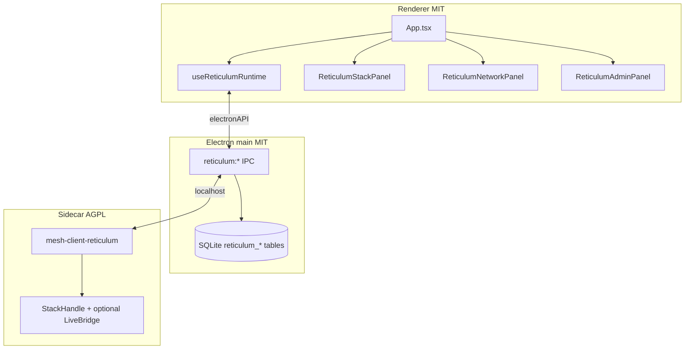

# Reticulum in mesh-client

Tracking: [#593](https://github.com/Colorado-Mesh/mesh-client/issues/593)

mesh-client ships Reticulum as a **third protocol tab** (amber chrome). The stack is an **AGPL Rust sidecar** (`mesh-client-reticulum`) spawned by Electron main; the MIT renderer talks to it through `electronAPI.reticulum` (HTTP/WS proxy). Chat history and contacts persist in the main-process SQLite database.

**Primary interop target:** [Ratspeak](https://github.com/ratspeak/Ratspeak) peers on rsReticulum/rsLXMF.

## Architecture


```mermaid
flowchart TB
  subgraph ui [Renderer MIT]
    App[App.tsx]
    RT[useReticulumRuntime]
    Stack[ReticulumStackPanel]
    Network[ReticulumNetworkPanel]
    Admin[ReticulumAdminPanel]
    App --> RT
    App --> Stack
    App --> Network
    App --> Admin
  end
  subgraph main [Electron main MIT]
    IPC[reticulum:* IPC]
    DB[(SQLite reticulum_* tables)]
    IPC --> DB
  end
  subgraph rust [Sidecar AGPL]
    Daemon[mesh-client-reticulum]
    StackH[StackHandle + optional LiveBridge]
    Daemon --> StackH
  end
  RT <-->|electronAPI| IPC
  IPC <-->|localhost| Daemon
```

## User flow

1. **Reticulum → Connection** (`ReticulumStackPanel`): click **Start stack** (or enable **Auto-start** for next visit). Add, edit, enable, or delete **Interfaces** here. **Stop stack** shuts down the sidecar without quitting the app; **Disconnect & quit** stops the sidecar (when running) and exits mesh-client.
2. **Reticulum → Network** (`ReticulumNetworkPanel`): create or import identity; import or export rnsd-style config; adjust stack settings and announce interval; manage propagation.
3. **Reticulum → Admin** (`ReticulumAdminPanel`): RNode firmware flasher and stack factory reset (danger zone).
4. **Chat:** DM-only LXMF text, reactions, file attachments, and voice clips (recorded as LXMF attachments).

**Diagnostics tab** shows Reticulum-native interface/path/LXMF health (not Meshtastic Hop Goblins). **Topology tab** builds a best-effort graph from the RNS path table: each row supplies one immediate next-hop (`via_hash`, a transport relay id that may differ from a hub’s destination hash). The sidecar infers `self → relay` links when a relay is only referenced as `via`. Layout uses BFS over edges with a `hops` fallback when a node is not reachable from `self`. This is not a full multi-hop trace—RNS exposes only the next hop per destination. Sidebar **Peers** tab ([`ReticulumPeerListPanel`](src/renderer/components/ReticulumPeerListPanel.tsx)) lists network path-table peers and LXMF contacts in separate sub-tabs.

## Panels

| Tab (sidebar) | Component                | Purpose                                                                                             |
| ------------- | ------------------------ | --------------------------------------------------------------------------------------------------- |
| Connection    | `ReticulumStackPanel`    | Stack start/stop, auto-start, interfaces CRUD, local interface health                               |
| Nomad Network | `NomadNetworkPanel`      | Favourites / Announces list, search, favourite toggle (MeshChat-style)                              |
| Peers         | `ReticulumPeerListPanel` | Network path-table peers and LXMF contacts (sub-tabs); path/probe; opens `ReticulumPeerDetailModal` |
| Network       | `ReticulumNetworkPanel`  | Identity, stack settings, announce controls, propagation, config import                             |
| Admin         | `ReticulumAdminPanel`    | RNode firmware flasher; stack factory reset (danger zone)                                           |

## Interface management (Connection tab)

Interfaces are stored in the sidecar rnsd config under Electron `userData/reticulum/config/`. The Connection tab **Interfaces** section supports:

| Action           | UI                                                            | Sidecar API                      |
| ---------------- | ------------------------------------------------------------- | -------------------------------- |
| Add              | Type selector (TCP / Auto / RNode) + form + **Add interface** | `POST /api/v1/interfaces`        |
| Edit             | **Edit** on a row → inline form                               | `PUT /api/v1/interfaces/{id}`    |
| Enable / disable | Per-row toggle                                                | `POST …/enable` or `…/disable`   |
| Delete           | **Delete** + confirmation modal                               | `DELETE /api/v1/interfaces/{id}` |

**Edit fields by type:**

- **All:** display name
- **TCP:** host, port
- **RNode:** USB serial, **Bluetooth** (`ble://…` URI), or **Wi-Fi** (`tcp://host[:7633]`, default port **7633**), LoRa preset, callsign — use **Pick device** for serial/BLE selection; Wi-Fi uses host + port fields
- **BLE Peer mesh:** optional seed peer addresses (sidecar spawns `BlePeerInterface` at runtime)
- **Auto:** name only (minimal discovery interface)

**Bluetooth coexistence:** Meshtastic, MeshCore, and Reticulum may each use Bluetooth **simultaneously on different devices** (macOS, Windows, and Linux). The app tracks peripheral ownership by MAC address and serializes **active scans** only—connected GATT links are not torn down when another stack scans or connects elsewhere. Do not point two protocols at the same BLE MAC; the app rejects same-device conflicts. On Linux, mesh stacks use Web Bluetooth in the renderer while Reticulum uses the sidecar `btleplug` stack.

For bulk changes or migrating from another rsReticulum install, use **Config import** (merge or replace) on the **Network** tab, or paste from a file picked via the system config paths below.

### Config audit and repair

The sidecar compares parsed config to the live interface list:

- **Ghost TCP interfaces:** enabled in config but not loaded by RNS (often wrong `enabled` vs `interface_enabled` key).
- **Unreachable TCP hubs:** live interface down while enabled.
- **RF mismatches:** enabled RNodes on different coordinated/fallback profiles.

Use **Diagnostics → Reticulum interface config** or inline hints on **Connection → Interfaces**. **Repair config** normalizes TCP blocks and legacy preset ids; **Apply preset** writes coordinated defaults from the selected preset id.

### RNode RF presets (coordinated + fallback)

Preset picker groups:

| Tier                 | Examples                                                                        | Notes                            |
| -------------------- | ------------------------------------------------------------------------------- | -------------------------------- |
| Coordinated regional | `rnode_us` (914.875 MHz), `rnode_uk`, `rnode_au`, …                             | Community-agreed offsets         |
| Global fallback      | `rnode_eu_fallback` (867.2 MHz), `rnode_eu_high_fallback`, `rnode_2g4_fallback` | Early Reticulum guide defaults   |
| Legacy aliases       | `rnode_us915` → `rnode_us`, `rnode_eu868` → `rnode_eu_fallback`                 | Migrated automatically on repair |

Canonical data: [`src/shared/reticulumRnodeRfProfiles.json`](../src/shared/reticulumRnodeRfProfiles.json).

## RNode over Wi-Fi

RNode Wi-Fi is **not** a separate interface type. It stays **`RNodeInterface`** with `port = tcp://host[:7633]` (default TCP port **7633**). Do **not** use the **TCP Client** interface type (default mesh port **4242**) for RNode Wi-Fi.

| Step      | Action                                                                                                                                                            |
| --------- | ----------------------------------------------------------------------------------------------------------------------------------------------------------------- |
| Provision | USB → **Admin → Wi-Fi** (station SSID/PSK, or AP mode), **or** ~10 s button hold → join RNode AP → bootstrap console at `http://10.0.0.1`, **or** `rnodeconf` CLI |
| Interface | **Connection → Interfaces** → type **RNode** → transport **Wi-Fi** → host/IP + port (7633) + LoRa preset                                                          |
| Hardware  | ESP32-S3 Wi-Fi-capable boards; plain ESP32 Wi-Fi is disabled in stock firmware                                                                                    |
| Pitfall   | Wi-Fi is **off after flash** until provisioned; find the station IP on the OLED alternate page, router DHCP, or Admin **Read config**                             |

The sidecar must be built with **`rns-rnode-tcp`** (included in mesh-client release builds) for `tcp://` RNode interfaces to connect at runtime.

## Stack settings and announces (Network tab)

**Stack settings** (`enable_transport`, `share_instance`, `loglevel`) are saved via `PUT /api/v1/stack/settings`. The UI merge-reads current settings so `announce_interval_sec` is preserved when saving transport/log options.

**Announce controls** ([`ReticulumAnnounceControls`](src/renderer/components/ReticulumAnnounceControls.tsx)): set announce interval (`announce_interval_sec`, 0–86400) and **Clear announces** (`DELETE /api/v1/announces`). With the **stub** sidecar, clear announces empties the persisted peer cache. With **`rns-stack`**, the live path table may repopulate on the next refresh until RNS path-table clear is wired.

## RNode firmware flasher (Admin tab)

The **Reticulum → Admin** tab lists **RNode Firmware Flasher** as a collapsible section (visible before the stack starts). It uses the renderer **Web Serial API** to:

1. Flash nRF52 devices (DFU touch + zip manifest) or ESP32 devices (`esptool-js`).
2. **Provision** EEPROM on new hardware (device info, MD5 checksum, lock byte).
3. **Set firmware hash** after each flash (reads hash from device).
4. Optional advanced tools: Bluetooth, **Wi-Fi** (station/AP provisioning), TNC mode, display read/rotation, EEPROM wipe.

**Serial port contention:** stop the Reticulum stack (or disable the active RNode interface) before flashing—the sidecar holds the serial port when an RNode interface is enabled. Disconnect Meshtastic or MeshCore USB serial on the same device.

Firmware `.zip` files are selected locally (in-app GitHub download is deferred).

## Peers and sidecar storage

- **`GET /api/v1/peers`**: with **`rns-stack`**, returns the live RNS path table (including empty); the sidecar updates its in-memory cache on each successful fetch. On fetch failure, the last cached peers are returned. With the **stub** stack, peers come from persisted state.
- **Your node is not listed as a peer:** the path table contains routes to **remote** destinations only. Your LXMF hash appears under **Network → Identity**; the topology graph uses a synthetic **You** center node. The `interface` column on a peer row means “path learned via this interface,” not “peers attached to this serial port.”
- **Stub storage file:** `userData/reticulum/storage/mesh_client_stack.json` — identity (including mnemonic in plaintext for backup UX), stub peers, and local LXMF message cache. Treat this file as sensitive.

## LXMF outbound delivery (Chat DMs)

With **`rns-stack`**, `POST /api/v1/lxmf/send` chooses delivery method from the path table:

| Destination in path table?                | Delivery method                               | UI                                                                        |
| ----------------------------------------- | --------------------------------------------- | ------------------------------------------------------------------------- |
| Yes                                       | **Direct** (LinkDeliveryManager)              | RF/TCP/NET badge while sending; **Delivered** after link completion       |
| No, preferred propagation node configured | **Propagated** (handoff to PN)                | **PN** badge, “Queued at propagation node” until sidecar reports delivery |
| No, no propagation node                   | `{ ok: false, error: "no_propagation_node" }` | Toast prompts user to set a preferred propagation node on the Network tab |

The chat UI keeps outbound messages in **Sending** until the sidecar emits `lxmf_outbound_status` (`delivered` / `failed`). This follows Reticulum’s async LXMF model—no TCP-style “connection refused” when a contact is offline; configure a propagation node for store-and-forward instead.

## LXMF attachments and voice clips

- **Send:** Chat composer paperclip (files) or mic button (voice clip, max ~60 s) on Reticulum DMs. Outbound uses `POST /api/v1/lxmf/resource` with `FIELD_FILE_ATTACHMENTS` on the live stack.
- **Receive:** Inbound attachments are cached under `userData/reticulum/attachments/`; chat shows playback for audio and **Save attachment** / **Show in folder** actions. Paths are jailed to that directory in the main process — arbitrary `attachment_path` values in SQLite are rejected at save time and **Show in folder** only opens jailed paths.
- **Realtime voice calls (LXST/Codec2):** not in scope; the Network tab no longer shows a voice-call stub.

## Propagation nodes

- **Preferred node:** offline DMs route to the preferred propagation node when the destination is not in the path table.
- **Sync:** Per-node **Sync messages** on the Network tab; progress via `propagation_sync` WebSocket events (also surfaced in Chat while syncing).
- **Local inbox:** Enable **Local propagation (offline inbox)** on the Network tab to serve as a propagation node (`rns-stack`); stats show queued count and storage used.
- **Add remote node:** Paste a 32-character destination hash in the propagation section to add a known MeshChat/Ratspeak propagation node.

## Building the sidecar

### Stub (CI / no siblings)

```bash
cd reticulum-sidecar && cargo test && cargo build
```

Uses a file-backed local stack (full API surface for dev/UI).

### Full rsReticulum stack (dev)

Sibling layout (same as Ratspeak):

```
parent/
  rsReticulum/          # git clone https://github.com/ratspeak/rsReticulum
  rsLXMF/               # git clone https://github.com/ratspeak/rsLXMF
  mesh-client/
    reticulum-sidecar/
```

```bash
pnpm run reticulum:sidecar:build -- --features rns-stack
# or: cd reticulum-sidecar && cargo build --features rns-stack
```

Optional: `rns-serial`, `rns-ble`, `rns-rnode-tcp` features for RNode USB serial, BLE, and Wi-Fi (`tcp://`) transports.

CI builds both **stub** and **`rns-stack`** matrix jobs on linux x64, macOS arm64, and Windows x64/arm64 (see `.github/workflows/reticulum-sidecar.yaml`). Each job runs `cargo test` before release build.

## IPC contract

See [reticulum-sidecar-ipc.md](reticulum-sidecar-ipc.md). Renderer must not call localhost directly (sandbox). Main-process proxy paths must start with `/api/v1/`.

## SQLite

- `reticulum_destinations` — contact rows (hash, display name, favorited).
- `reticulum_messages` — LXMF chat history (`message_hash`, `reply_to_hash` for threads/reactions).

## Config import

Default system paths (main process reads; renderer imports via sidecar):

| Platform      | Paths                                                                          |
| ------------- | ------------------------------------------------------------------------------ |
| macOS / Linux | `~/.reticulum/config`, `~/.config/rsReticulum/config`, `~/.rsReticulum/config` |
| Windows       | `%APPDATA%\Reticulum\config`, `%APPDATA%\rsReticulum\config`                   |

The sidecar stores the active config under Electron `userData/reticulum/config/` (rnsd INI format).

## Out of scope / in progress

- **LXST voice** and **LRGP games**: API status endpoints exist; full rsLXST/lrgp-rs integration is tracked separately.
- **Hardware identity (YubiKey/PIV)**: not yet wired.
- **Interface hot-reload** under `rns-stack`: CRUD updates config on disk; **restart the stack** after add, edit, or **delete** so live RNS drops stale transports.
- **RNode Wi-Fi (`tcp://`)**: use bracketed IPv6 literals (`tcp://[2001:db8::1]:7633`); unbracketed IPv6 with an explicit port is rejected by the UI parser.
- **Identity vault**: minimum 8-character passcode; unlock is rate-limited in the main process. Sidecar stub mode may return a one-time mnemonic on generate — it is **not** written to `mesh_client_stack.json` on disk.
- **Meshtastic/MeshCore RF paths**: ConnectionDriver, MQTT hybrid, channel config, Rooms BBS, Hop Goblins diagnostics.
